# Benchmark results in environments

We tested our environments on some safe reinforcement learning algorithms using [OmniSafe](https://github.com/PKU-Alignment/omnisafe) as an out-of-the-box RL framework. The results are shown below.

## Important notes
- All the algorithms are tested on the same hardware [AMD EPYC 7H12 64-Core Processor].
- The algorithms are tested with the same hyperparameters which are defaulted in [OmniSafe](https://github.com/PKU-Alignment/omnisafe/tree/main/omnisafe/configs/on-policy).
- Each algorithm is tested on at least 5 seeds and the average performance and standard deviation are shown in the figure. And the five seeds are [0, 5, 10, 15, 20]. We believe that the results are stable.
- The `Goal`, `Push`, and `Button` in `v0` series tasks of Safe Navigation are implemented as the original settings of [Safety-Gym](https://openai.com/research/safety-gym), We just made them more intelligible and accessible. The same situation happens on agents which appear in Safety-Gym. Further, we will fix some defects of design in the original Safety-Gym and release the new version of tasks as `v1` to facilitate research in the SafeRL community.
- The `Racecar` and `Ant` agents are newly added to `Safety-Gymnasium`, We are currently fine-tuning the physical parameters of these agents to make them more realistic and more compatible with various tasks. If you find any issues when using them, please feel free to open an issue, and we are welcome to PRs.

## Benchmark results
### SafetyAntVelocity-v1(1e6)

    
     

### SafetyAntVelocity-v1(1e7)

    
     

### SafetyHalfCheetahVelocity-v1(1e6)

    
     

### SafetyHalfCheetahVelocity-v1(1e7)

    
     

### SafetyHopperVelocity-v1(1e6)

    
     

### SafetyHopperVelocity-v1(1e7)

    
     

### SafetyHumanoidVelocity-v1(1e6)

    
     

### SafetyHumanoidVelocity-v1(1e7)

    
     

### SafetyWalker2dVelocity-v1(1e6)

    
     

### SafetyWalker2dVelocity-v1(1e7)

    
     

### SafetySwimmerVelocity-v1(1e6)

    
     

### SafetySwimmerVelocity-v1(1e7)

    
     

### SafetyPointGoal0-v0(1e7)

    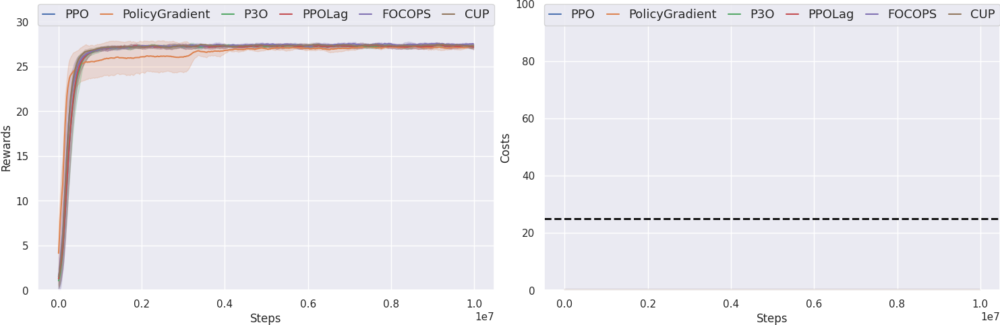
     

### SafetyPointGoal1-v0(1e7)

    
     

### SafetyPointGoal2-v0(1e7)

    
     

### SafetyCarGoal0-v0(1e7)

    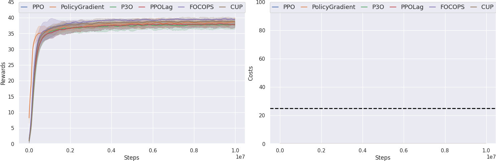
     

### SafetyCarGoal1-v0(1e7)

    
     

### SafetyCarGoal2-v0(1e7)

    
     

### SafetyPointButton0-v0(1e7)

    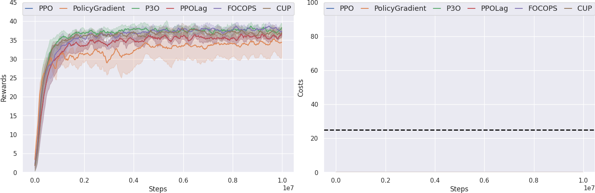
     

### SafetyPointButton1-v0(1e7)

    
     

### SafetyPointButton2-v0(1e7)

    
     

### SafetyCarButton0-v0(1e7)

    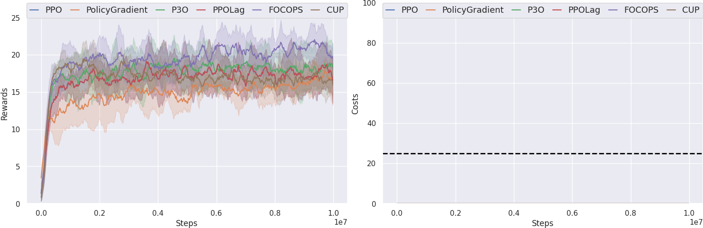
     

### SafetyCarButton1-v0(1e7)

    
     

### SafetyCarButton2-v0(1e7)

    
     

### SafetyPointPush0-v0(1e7)

    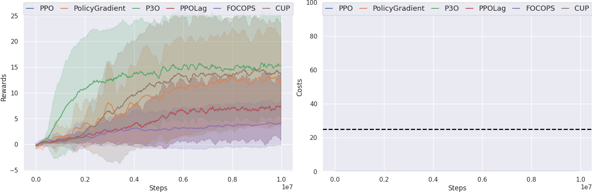
     

### SafetyPointPush1-v0(1e7)

    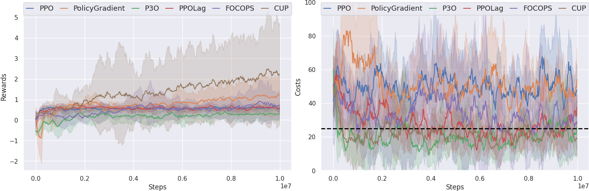
     

### SafetyPointPush2-v0(1e7)

    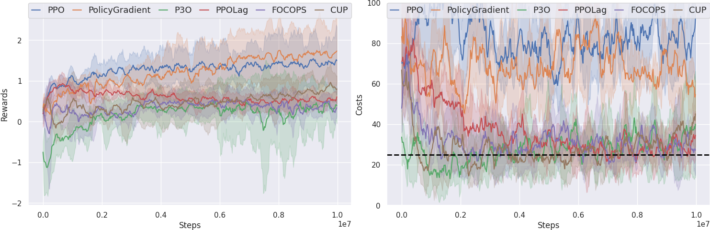
     

### SafetyCarPush0-v0(1e7)

    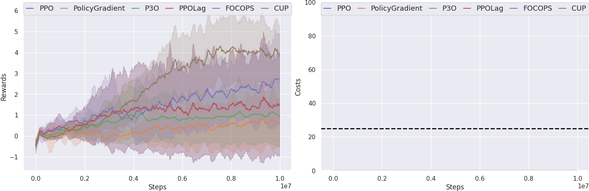
     

### SafetyCarPush1-v0(1e7)

    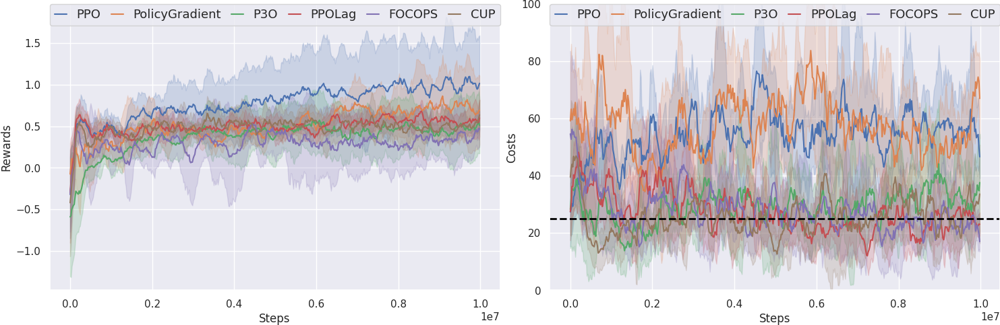
     

### SafetyCarPush2-v0(1e7)

    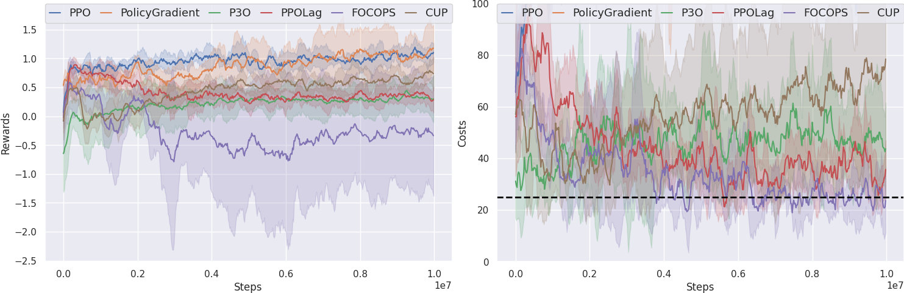
     

### SafetyPointCircle0-v0(1e7)

    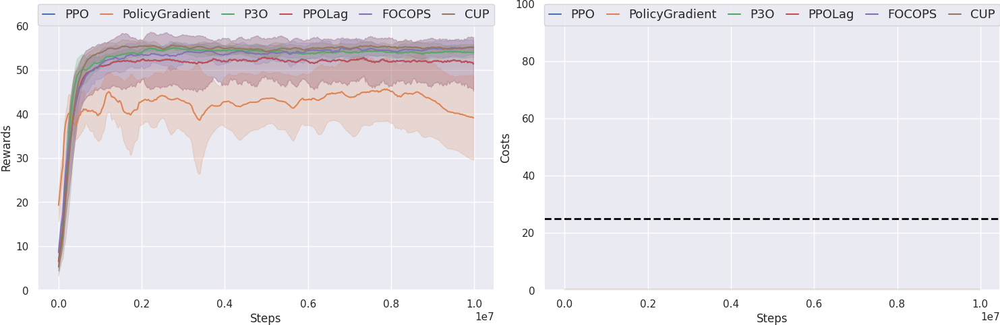
     

### SafetyPointCircle1-v0(1e7)

    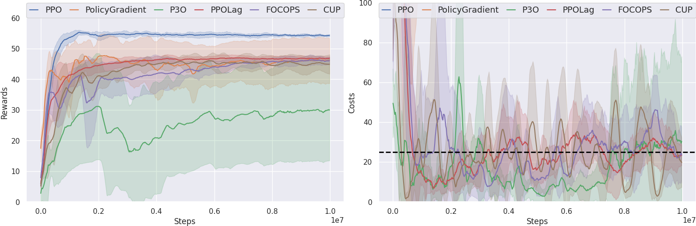
     

### SafetyPointCircle2-v0(1e7)

    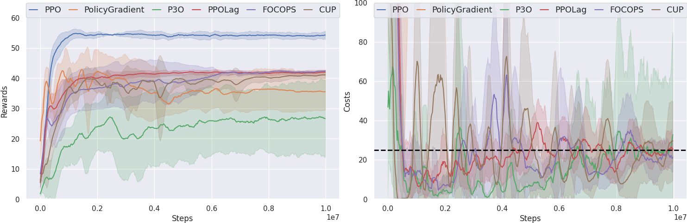
     

### SafetyCarCircle0-v0(1e7)

    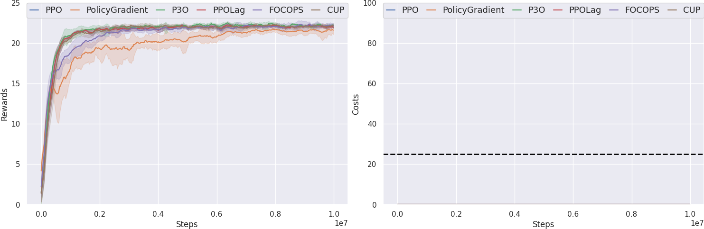
     

### SafetyCarCircle1-v0(1e7)

    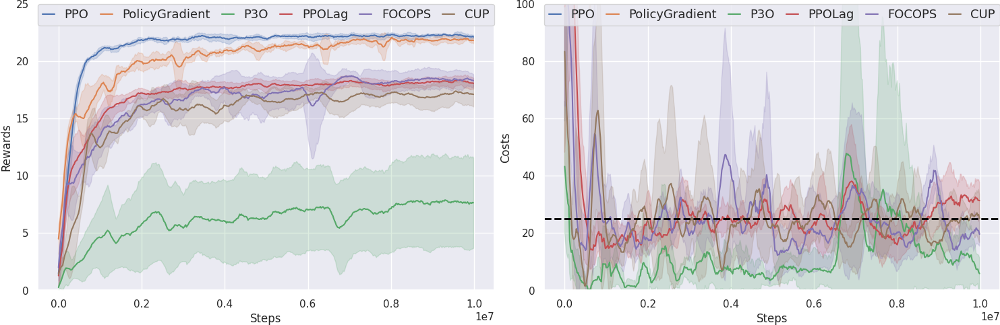
     

### SafetyCarCircle2-v0(1e7)

    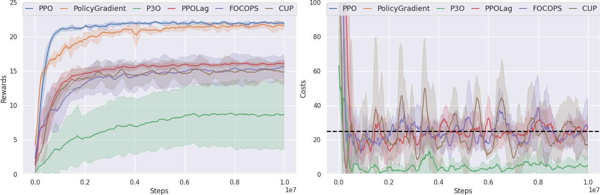
     

