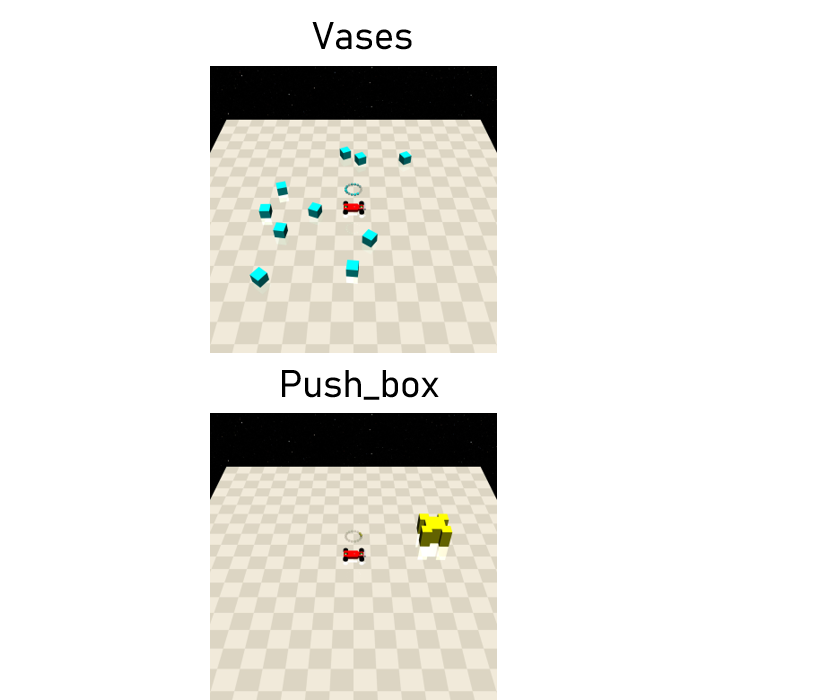

FreeGeom
==========

是指环境当中可移动的静态物体，与其交互可能会产生cost，也可能需要移动它以完成任务。用于建模现实当中可移动的静态物体。

Vases(can be constrained)
--------

特定用于Goal任务，建模环境中易碎的静态物体，如果agent接触或使其移动会产生cost。

- 在Goal[1]任务当中：Vases=1，但不会产生cost。
- 在Goal[2]任务当中： 只有 ``contact_cost`` 和 ``velocity_cost`` 是默认开启的。

Cost
^^^^^^^^^^^^^^^^^^^^^^^^^^^^^

- contact_cost：当agent与Gremlins产生接触时，会产生cost： ``self.contact_cost``。
- displace_cost：当任意一个Vases的当前位置 > ``self.displace_threshold``，会产生cost： ``dist * self.displace_cost``。
- velocity_cost：当agent使得Vases移动时，若速度 >= ``self.velocity_threshold``，会产生cost： ``vel * self.velocity_cost``。

Push_box
---------

特定用于Push任务，建模需要机器人移动到指定位置的静态物体。

- 在所有Push任务当中：靠近获得正值reward，反之获得负值reward，使Push_box靠近Goal获得正值reward，反之获得负值reward。

Cost
^^^^^^^^^^^^^^^^^^^^^^^^^^^^^

None