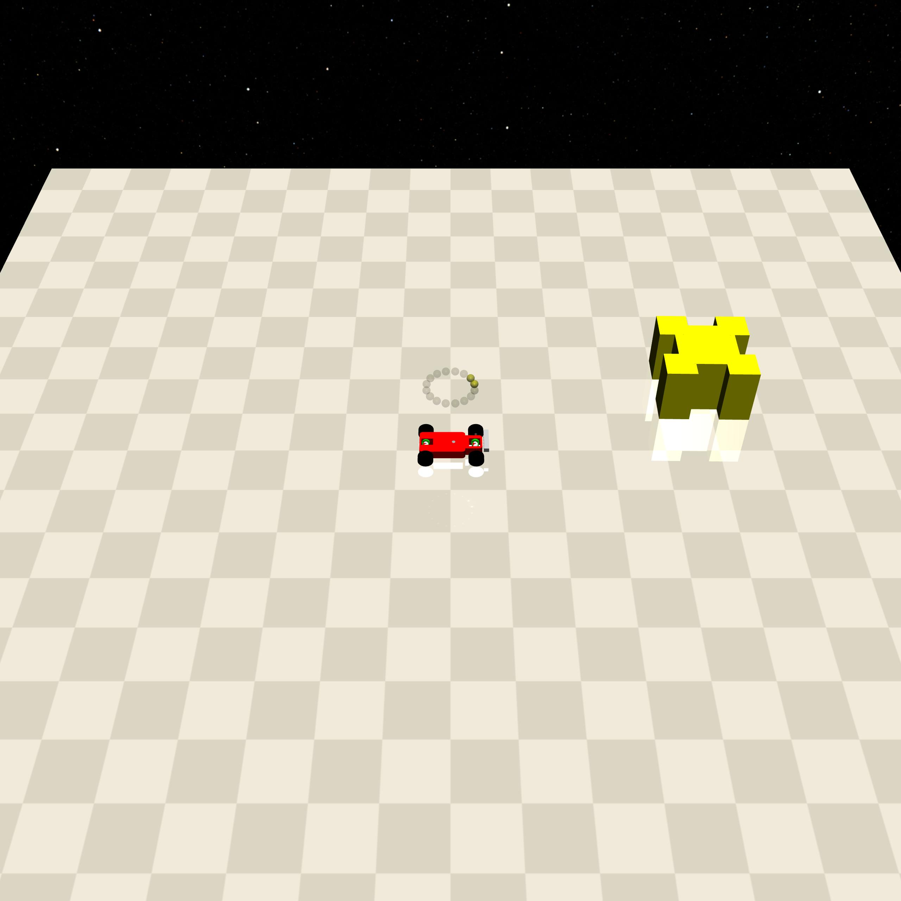

FreeGeom
========

Refers to a movable static object in the environment, with which interaction may result in cost, or which may need to be moved to complete a task. It is used to model realistic static objects that can be moved.

.. list-table::

    * - .. figure:: ../../_static/images/vases.jpeg
            :width: 230px
            :target: #vases
        .. centered:: :ref:`Vases`
      - .. figure:: ../../_static/images/push_box.jpeg
            :width: 230px
            :target: #push_box
        .. centered:: :ref:`Push_box`

.. _Vases:

Vases
-----

.. image:: ../../_static/images/vases.jpeg
    :align: center
    :scale: 12 %

===================== ===============
Can be constrained    No collision
===================== ===============
   ✅                  ❌
===================== ===============

Specifically for Goal tasks, modeling fragile static objects in the environment that would generate cost if the agent touched or made them move.

- In the Goal[1] task: Vases=1, but no cost is generated.
- In the Goal[2] task: only ``contact_cost`` and ``velocity_cost`` are enabled by default.

Constraints
^^^^^^^^^^^

.. _Vases_contact_cost:

- contact_cost: When the agent makes contact with Gremlins, it generates cost: ``self.contact_cost``.

.. _Vases_displace_cost:

- displace_cost: When the current position of any of the Vases > ``self.displace_threshold``, it generates cost: ``dist * self.displace_cost``.

.. _Vases_velocity_cost:

- velocity_cost: When agent makes Vases move, if velocity >= ``self.velocity_threshold``, it will generate cost: ``vel * self.velocity_cost``.

.. _Push_box:

Push_box
---------

===================== ===============
Can be constrained    No collision
===================== ===============
   ❌                  ❌
===================== ===============

Specifically for Push tasks, modeling static objects that require the robot to move to a specified location.

- Among all Push tasks: Get closer to get a positive reward, getting farther will cause a negative reward. Make Push_box closer to Goal to get a positive reward, making Push_box farther to Goal will get a negative reward.

Constraints
^^^^^^^^^^^

Nothing.
