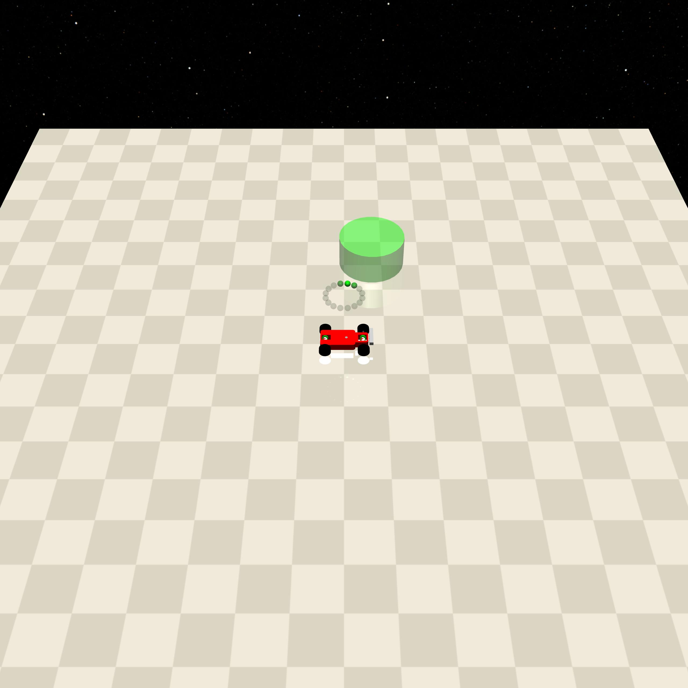
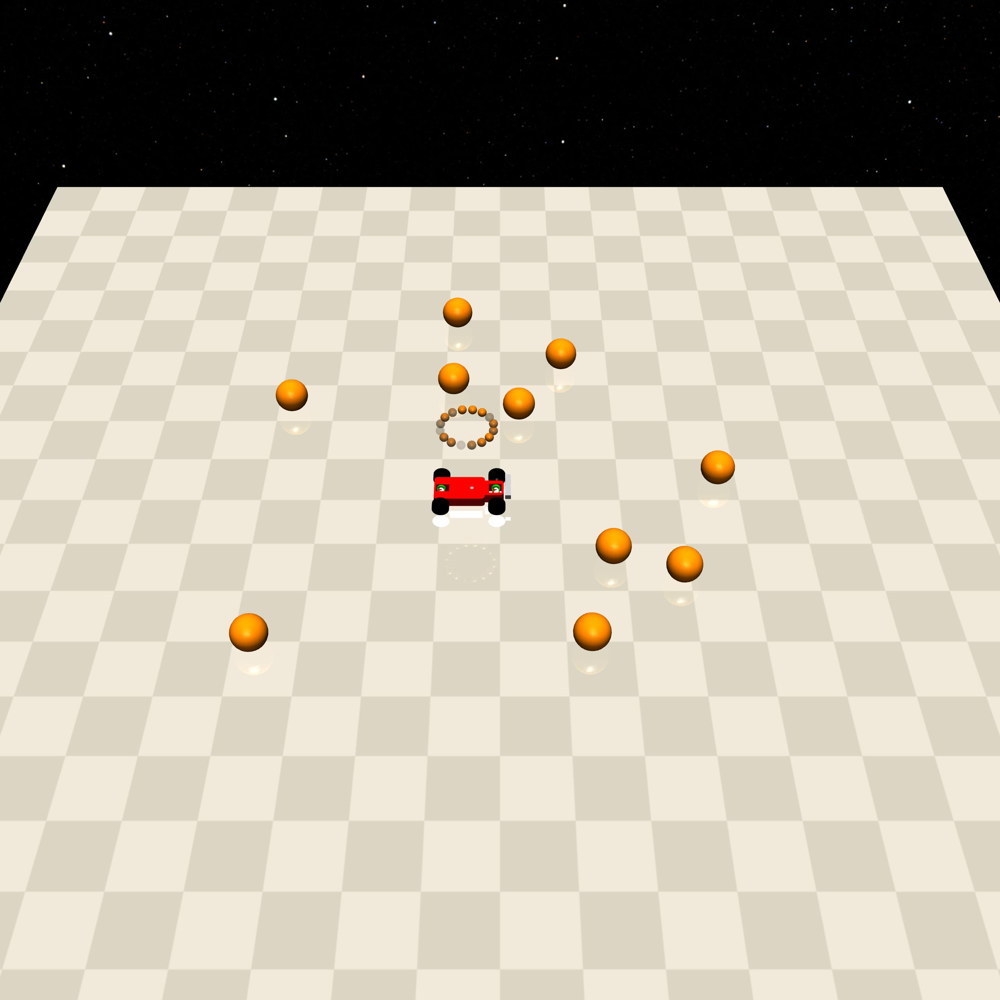
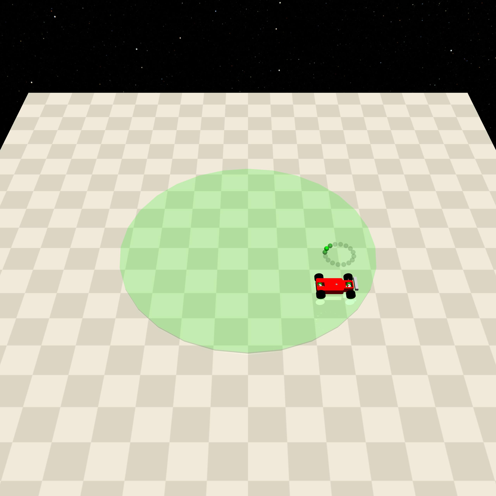
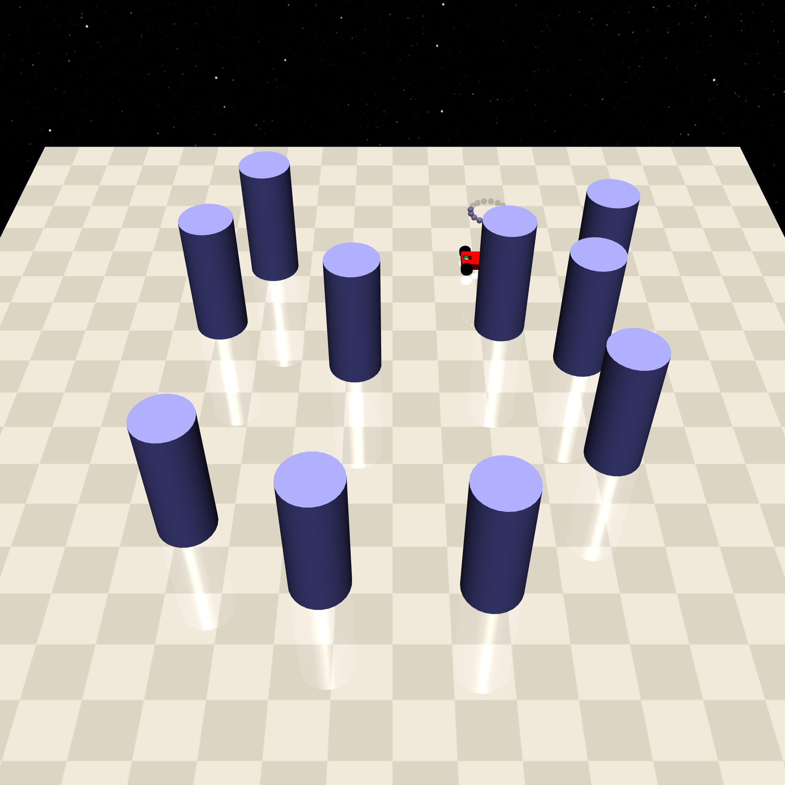
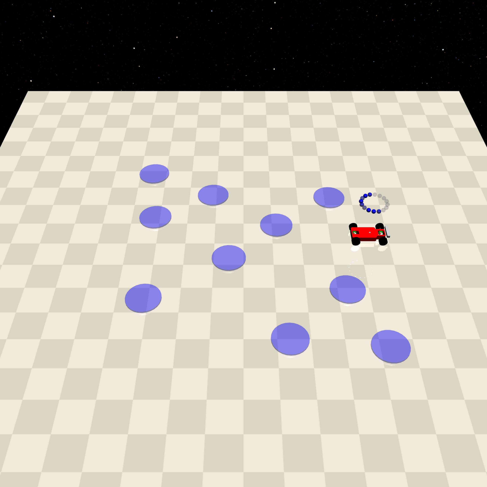
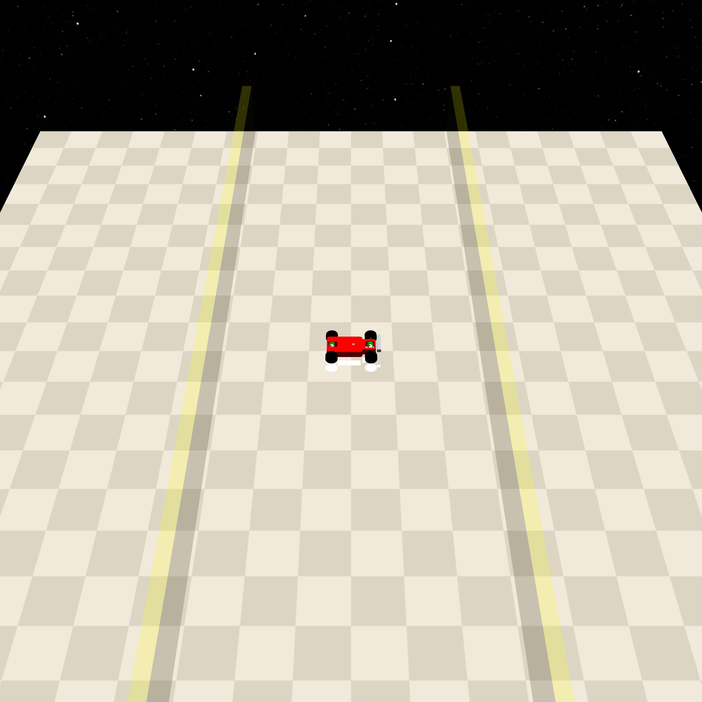
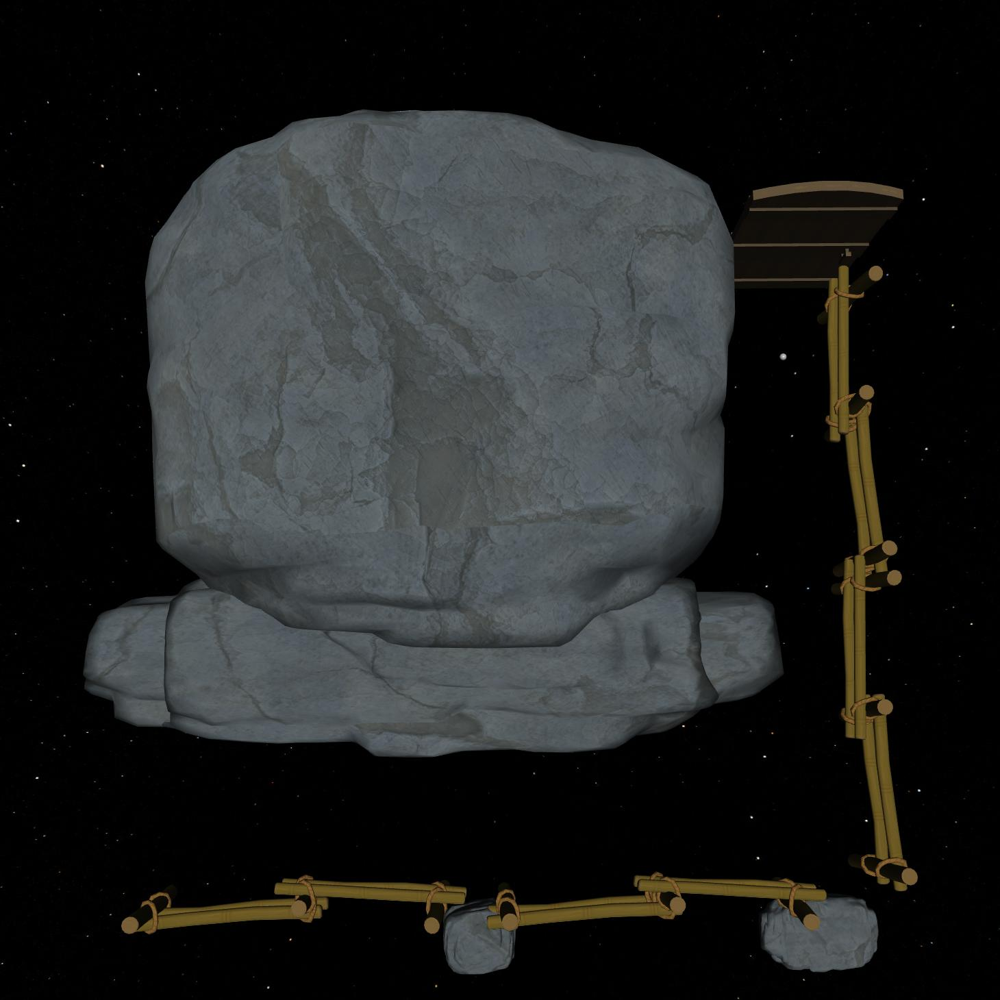

Geom
====

It is a static object in the environment that cannot change its position by contact and collision. It is used to model static objects that are fixed in reality.

.. list-table::

    * - .. figure:: ../../_static/images/goal.jpeg
            :width: 230px
            :target: #goal
        .. centered:: :ref:`Goal`
      - .. figure:: ../../_static/images/buttons.jpeg
            :width: 230px
            :target: #buttons
        .. centered:: :ref:`Buttons`
      - .. figure:: ../../_static/images/circle.jpeg
            :width: 230px
            :target: #circle
        .. centered:: :ref:`Circle`
    * - .. figure:: ../../_static/images/pillars.jpeg
            :width: 230px
            :target: #pillars
        .. centered:: :ref:`Pillars`
      - .. figure:: ../../_static/images/hazards.jpeg
            :width: 230px
            :target: #hazards
        .. centered:: :ref:`Hazards`
      - .. figure:: ../../_static/images/sigwalls.jpeg
            :width: 230px
            :target: #sigwalls
        .. centered:: :ref:`Sigwalls`

.. _Goal:

Goal
----

===================== ===============
Can be constrained    No collision
===================== ===============
   ❌                  ✅
===================== ===============

Used to model the target location in the environment.

- In the general setting: Get closer to the location of Goal to get a positive reward, and getting farther will cause a negative reward. Arrive to get the task completion reward, after which the target location will be refreshed.

Constraints
^^^^^^^^^^^^^^^^^^^^^^^^^^^^^

Nothing.

.. _Buttons:

Buttons
-------------------------

===================== ===============
Can be constrained    No collision
===================== ===============
   ✅                  ❌
===================== ===============

Specifically for the Button task, four solid, fixed-position buttons are modeled, and one button is randomly selected as the target button, which must be approached and pressed.

- In the button[012] task: get a positive reward for being close to the target button, get a negative reward for being far away, and get a task completion reward for reaching it, after which the target button will be refreshed. Just after reaching a goal, there will be a period of time when all buttons are unobservable, and no cost will be generated by touching the button.

- In button[12]: If the wrong button is pressed, cost will be generated.

Constraints
^^^^^^^^^^^

.. _Buttons_press_wrong_button:

- press_wrong_button: If agent touches a button other than ``goal_button`` when ``self.timer == 0`` (initial value is 10, minus 1 for each time step), it will generate cost: ``self.cost``.

.. _Circle:

Circle
-------------

===================== ===============
Can be constrained    No collision
===================== ===============
   ❌                  ✅
===================== ===============

Specifically used in the Circle task to visualize a ``size`` sized circular area.

Constraints
^^^^^^^^^^^^^^^^^^^^^^^^^^^^^

Nothing.

.. _Pillars:

Pillars
-------------------------

===================== ===============
Can be constrained    No collision
===================== ===============
   ✅                  ❌
===================== ===============

Used to model large cylindrical obstacles in the environment.

- In the general setting: contact with it will incur cost.

Constraints
^^^^^^^^^^^^^^^^^^^^^^^^^^^^^

.. _Pillars_contact_cost:

- contact_cost: When the agent comes into contact with Pillars, a cost will be generated: ``self.cost``

.. _Hazards:

Hazards
-------------------------

===================== ===============
Can be constrained    No collision
===================== ===============
   ✅                  ✅
===================== ===============

Used to model hazardous areas in the environment where entering the area generates cost.

Constraints
^^^^^^^^^^^^^^^^^^^^^^^^^^^^^

.. _Hazards_cost_hazards:

- cost_hazards: When the distance of the agent from the center of the hazards ``h_dist <= self.size``, the cost is generated: ``self.cost * (self.size - h_dist)``.

.. _Sigwalls:

Sigwalls
-------------------------

===================== ===============
Can be constrained    No collision
===================== ===============
   ✅                  ✅
===================== ===============

Specifically for Circle tasks, visualize 2 or 4 solid-free walls to limit the circular area to a smaller area where crossing the wall from inside the safe area to the outside will generate cost.

- Circle[1]: Constrain on the x-axis to generate 2 walls.
- Circle[2]: Constrain on the x-y axis to generate 4 walls.

Constraints
^^^^^^^^^^^^^^^^^^^^^^^^^^^^^

.. _Sigwalls_out_of_boundary_cost:

- out_of_boundary_cost: When the agent crosses the boundary from inside the circular domain outward, it generates cost: ``1``

.. _Fixedwalls:

Fixedwalls
-------------------------

===================== ===============
Can be constrained    No collision
===================== ===============
   ✅                  ❌
===================== ===============

In **certain scenarios**, especially when modeling complex visual tasks, irregular fixed walls are utilized. These walls are designed to simulate real-world fixed obstacles as accurately as possible. Both the shape and position of these walls remain constant within a given task.

Constraints
^^^^^^^^^^^^^^^^^^^^^^^^^^^^^

.. _Static_geoms_contact_cost:

- cost_static_geoms_contact: This parameter incurs a cost of ``1`` when the agent comes into contact with ``FixedWalls``.
