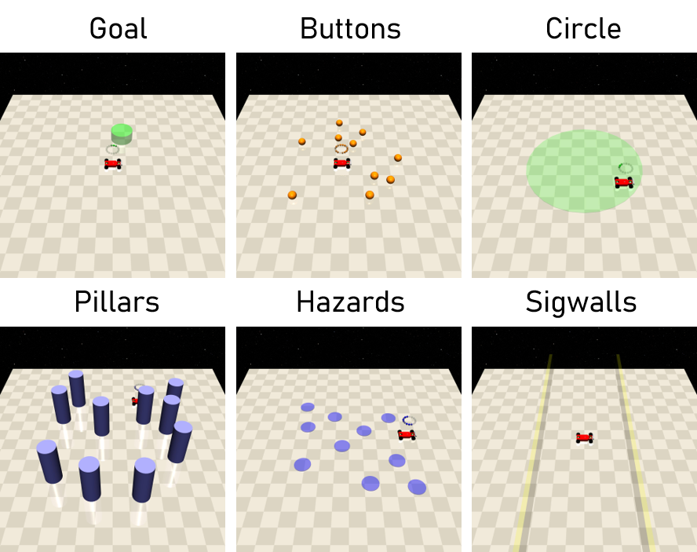

Geom
==========

是指环境当中不可通过接触和碰撞来改变位置的静态物体。用于建模现实当中固定的静态物体。

Goal(no collision)
-------------------------

用于建模环境当中的目标位置。

- 在一般setting下：靠近该位置获得正值reward，反之获得负值reward，到达获得任务完成奖励，之后将会刷新目标位置。

Cost
^^^^^^^^^^^^^^^^^^^^^^^^^^^^^

None

Buttons(can be constrained)
-------------------------

特定用于Button任务当中，建模四个拥有实体且固定位置的按钮，且会随机选择一个按钮作为目标按钮，必须靠近并且按压该按钮。

- 在button[012]任务当中：靠近目标按钮获得正值奖励，远离获得负值奖励，到达获得任务完成奖励，之后将会刷新目标按钮。刚刚到达一个goal之后，会有一段时间不可观测到所有button，同时不会因为接触button产生cost。

- 在button[12]当中：若按压错误按钮，将会产生cost。

Cost
^^^^^^^^^^^^^^^^^^^^^^^^^^^^^

- press wrong button：当 ``self.timer == 0`` （初值为10，每个时间步减1）时，若agent触摸了 ``goal_button`` 以外的button，会产生cost： ``self.cost``。

Circle(no collision)
-------------

特定用于Circle任务当中，可视化一个 ``size`` 大小的圆形区域。

Cost
^^^^^^^^^^^^^^^^^^^^^^^^^^^^^

None

Pillars(can be constrained)
-------------------------

用于建模环境中大型圆柱体障碍物。

- 在一般setting下：与其接触会产生cost。

Cost
^^^^^^^^^^^^^^^^^^^^^^^^^^^^^

- contact cost：当agent与Pillars产生接触时，会产生cost： ``self.cost``

Hazards(can be onstrained)(no collision)
-------------------------

用于建模环境中的危险区域，进入该区域会产生cost。

Cost
^^^^^^^^^^^^^^^^^^^^^^^^^^^^^

- cost_hazards：当agent距离hazards中心的距离 ``h_dist <= self.size`` 时，会产生cost： ``self.cost * (self.size - h_dist)``。

Sigwalls(can be constrained)(no collision)
-------------------------

特定用于Circle任务当中，可视化2或4道无实体墙，将圆形区域限制为一个更小的区域，从安全区域内向外越过墙会产生cost。

Cost
^^^^^^^^^^^^^^^^^^^^^^^^^^^^^

- out_of_boundary：当agent从圆域内向外越过边界时，会产生cost： ``1``

