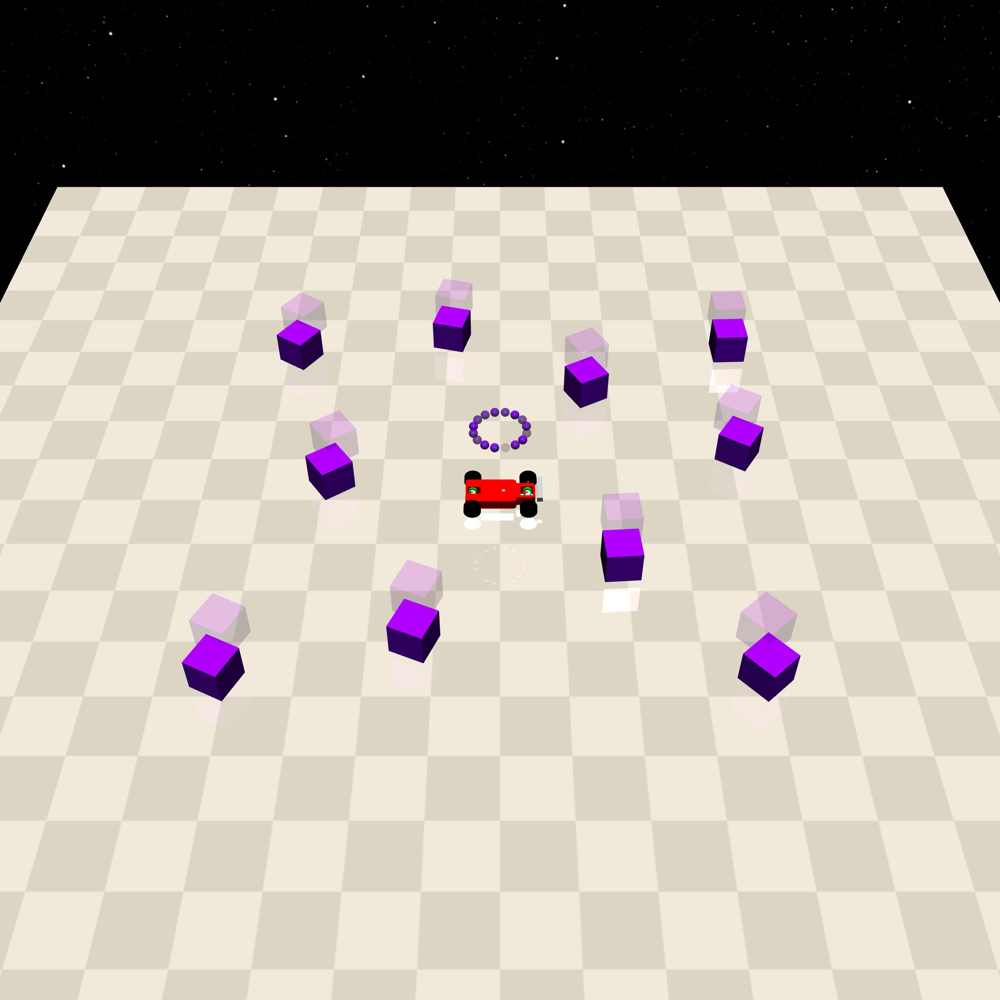

Mocap
=====

Refers to objects in the environment that move autonomously according to a certain pattern, and with which interaction may produce cost, or may affect the way they move through physical interaction. It is used to model realistic moving objects under control.

.. list-table::

    * - .. figure:: ../../_static/images/gremlins.jpeg
            :width: 230px
            :target: #gremlins
        .. centered:: :ref:`Gremlins`

.. _Gremlins:

Gremlins
--------

===================== ===============
Can be constrained    No collision
===================== ===============
   ✅                  ❌
===================== ===============

Specifically for the Button task, modeling moving objects in the environment.

- In Button [12]: contact with it generates cost.

Constraints
^^^^^^^^^^^

.. _Gremlins_contact_cost:

- contact_cost: When the agent makes contact with Gremlins, it generates cost: ``self.contact_cost``.
