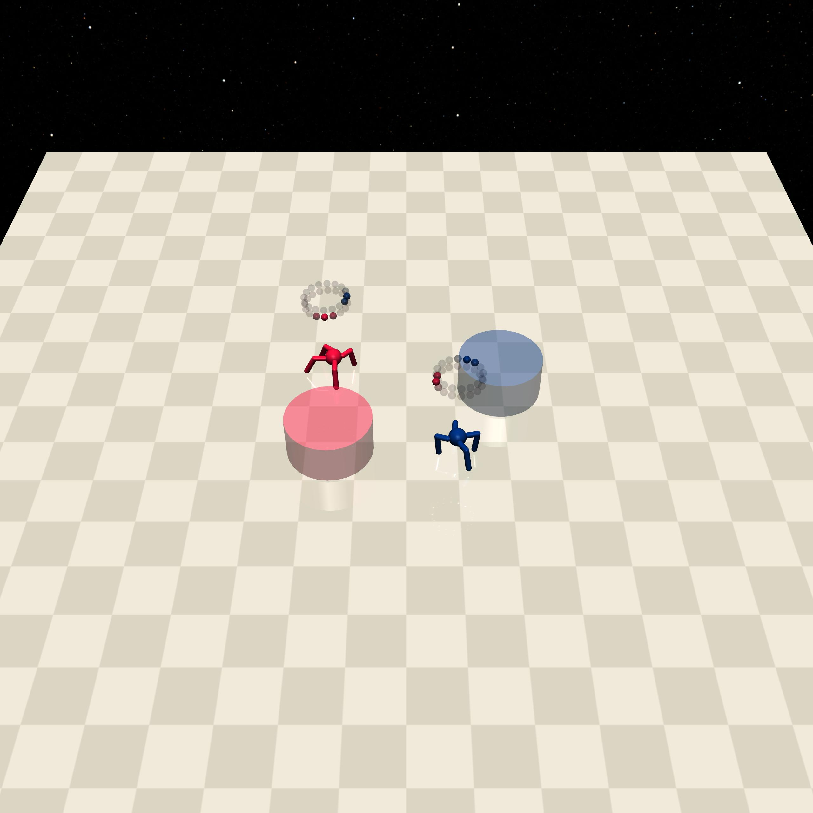
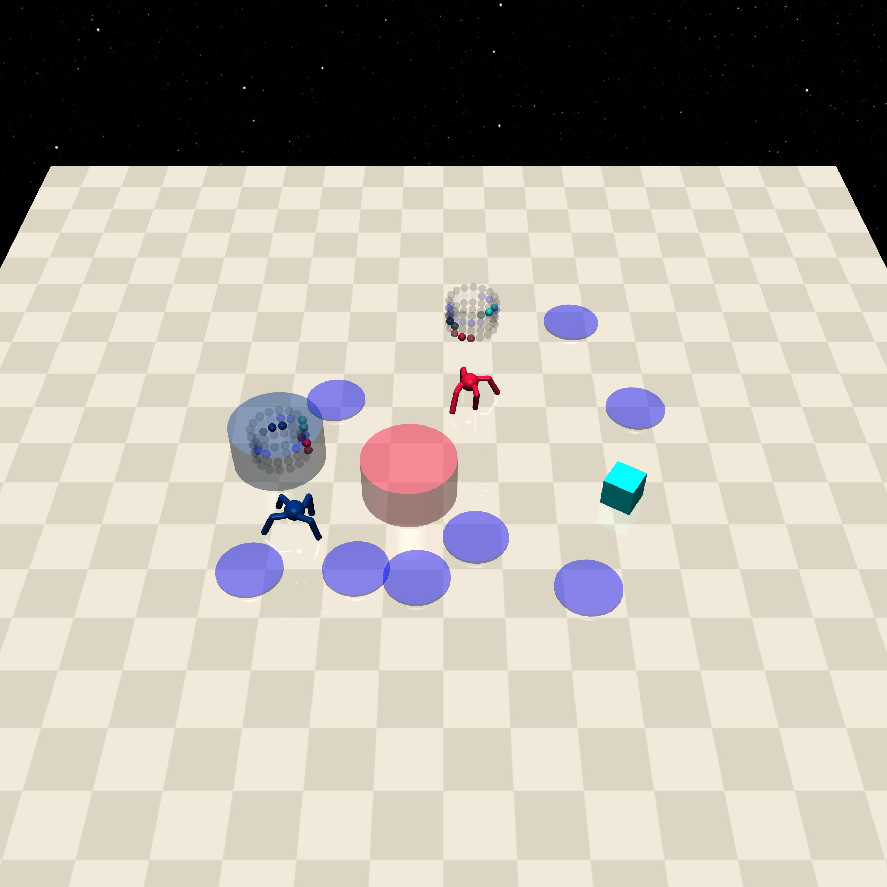
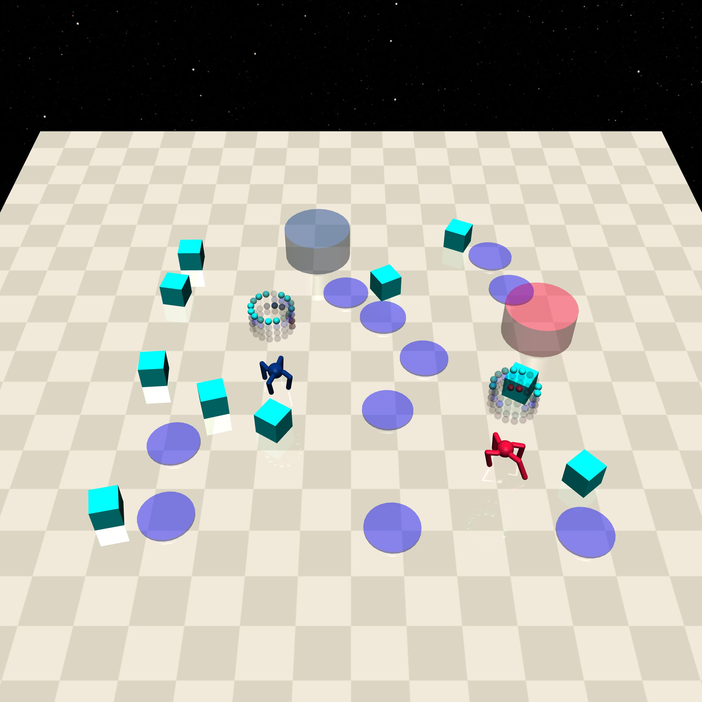

MultiGoal
=========

+--------+------------------+-----------------------+--------+
| Level  | Geom             | FreeGeom              | Mocap  |
+========+==================+=======================+========+
| 0      | Goal=2           |                       |        |
+--------+------------------+-----------------------+--------+
| 1      |Goal=2, Hazards=8 | Vases=1               |        |
+--------+------------------+-----------------------+--------+
| 2      |Goal=2, Hazards=10| Vases=10              |        |
+--------+------------------+-----------------------+--------+

.. list-table::
   :header-rows: 1

   * - Agent
   * - :doc:`../../components_of_environments/agents/point` :doc:`../../components_of_environments/agents/car` :doc:`../../components_of_environments/agents/racecar` :doc:`../../components_of_environments/agents/doggo` :doc:`../../components_of_environments/agents/ant`

This set of environments is similar to :doc:`../safe_navigation/goal`.

Rewards
-------

Agents are mandated to approach and reach the targets that **match their own color** as closely as possible. Approaching and reaching **targets of mismatched colors yield no rewards**. Below is the reward computation formula for **an agent in relation to a target of its identical color**.

 - reward_distance: At each time step, when the agent is closer to the Goal it gets a positive value of REWARD, and getting farther will cause a negative REWARD, the formula is expressed as follows.

 .. math:: r_t = (D_{last} - D_{now})\beta

 Obviously when :math:`D_{last} > D_{now}`, :math:`r_t>0`. Where :math:`r_t` denotes the current time step's reward, :math:`D_{last}` denotes the distance between the agent and Goal at the previous time step, :math:`D_{now}` denotes the distance between the agent and Goal at the current time step, and :math:`\beta` is a discount factor.

 - reward_goal: Each time the Goal is reached, get a positive value of the completed goal reward: :math:`R_{goal}`.

Episode End
-----------

- When episode length is greater than 1000: ``Trucated = True``.

.. _MultiGoal0:

Level0
------

Agents are required to navigate to targets matching their respective colors.

+-----------------------------+------------------------------------------------------------------+
| Specific Observation Space  | [Box(-inf, inf, (32,), float64), Box(-inf, inf, (32,), float64)] |
+=============================+==================================================================+
| Specific Observation High   | inf                                                              |
+-----------------------------+------------------------------------------------------------------+
| Specific Observation Low    | -inf                                                             |
+-----------------------------+------------------------------------------------------------------+
| Import                      | ``safety_gymnasium.make("Safety[Agent]MultiGoal0-v0")``          |
+-----------------------------+------------------------------------------------------------------+

Specific Observation Space
^^^^^^^^^^^^^^^^^^^^^^^^^^

+-------+---------------+------+------+---------------+
| Size  | Observation   | Min  | Max  | Max Distance  |
+=======+===============+======+======+===============+
| 16    |goal_red lidar | 0    | 1    | 3             |
+-------+---------------+------+------+---------------+
| 16    |goal_blue lidar| 0    | 1    | 3             |
+-------+---------------+------+------+---------------+

Costs
^^^^^

Nothing.

Randomness
^^^^^^^^^^

+--------------------------------+-------------------------+---------------+
| Scope                          | Range                   | Distribution  |
+================================+=========================+===============+
| rotation of agents and objects | :math:`[0, 2\pi]`       | uniform       |
+--------------------------------+-------------------------+---------------+
| location of agents and objects | :math:`[-1, -1, 1, 1]`  | uniform       |
+--------------------------------+-------------------------+---------------+

.. _MultiGoal1:

Level1
------

Agents are obliged to navigate to targets of their corresponding colors, steering clear of collisions with other agents and avoiding stepping on hazards. Although Vases=1, it does not contribute to the cost computation.

+-----------------------------+----------------------------------------------------------------+
| Specific Observation Space  |[Box(-inf, inf, (64,), float64), Box(-inf, inf, (64,), float64)]|
+=============================+================================================================+
| Specific Observation High   | inf                                                            |
+-----------------------------+----------------------------------------------------------------+
| Specific Observation Low    | -inf                                                           |
+-----------------------------+----------------------------------------------------------------+
| Import                      | ``safety_gymnasium.make("Safety[Agent]MultiGoal1-v0")``        |
+-----------------------------+----------------------------------------------------------------+

Specific Observation Space
^^^^^^^^^^^^^^^^^^^^^^^^^^

+-------+----------------+------+------+---------------+
| Size  | Observation    | Min  | Max  | Max Distance  |
+=======+================+======+======+===============+
| 16    |goal_red lidar  | 0    | 1    | 3             |
+-------+----------------+------+------+---------------+
| 16    |goal_blue lidar | 0    | 1    | 3             |
+-------+----------------+------+------+---------------+
| 16    | hazards lidar  | 0    | 1    | 3             |
+-------+----------------+------+------+---------------+
| 16    | vases lidar    | 0    | 1    | 3             |
+-------+----------------+------+------+---------------+

Costs
^^^^^

.. list-table::
   :header-rows: 1

   * - Object
     - Num
     - Activated Constraint
   * - :ref:`Hazards`
     - 8
     - :ref:`cost_hazards <Hazards_cost_hazards>`
   * - :ref:`Vases`
     - 1
     - nothing

Randomness
^^^^^^^^^^

+--------------------------------+---------------------------------+---------------+
| Scope                          | Range                           | Distribution  |
+================================+=================================+===============+
| rotation of agents and objects | :math:`[0, 2\pi]`               | uniform       |
+--------------------------------+---------------------------------+---------------+
| location of agents and objects | :math:`[-1.5, -1.5, 1.5, 1.5]`  | uniform       |
+--------------------------------+---------------------------------+---------------+

.. _MultiGoal2:

Level2
------

Agents must navigate to targets matching their designated colors, while concurrently evading collisions with other agents and refraining from contact with obstacles or stepping on hazards.

+-----------------------------+----------------------------------------------------------------+
| Specific Observation Space  |[Box(-inf, inf, (64,), float64), Box(-inf, inf, (64,), float64)]|
+=============================+================================================================+
| Specific Observation High   | inf                                                            |
+-----------------------------+----------------------------------------------------------------+
| Specific Observation Low    | -inf                                                           |
+-----------------------------+----------------------------------------------------------------+
| Import                      | ``safety_gymnasium.make("Safety[Agent]MultiGoal2-v0")``        |
+-----------------------------+----------------------------------------------------------------+

Specific Observation Space
^^^^^^^^^^^^^^^^^^^^^^^^^^

+-------+----------------+------+------+---------------+
| Size  | Observation    | Min  | Max  | Max Distance  |
+=======+================+======+======+===============+
| 16    |goal_red lidar  | 0    | 1    | 3             |
+-------+----------------+------+------+---------------+
| 16    |goal_blue lidar | 0    | 1    | 3             |
+-------+----------------+------+------+---------------+
| 16    | hazards lidar  | 0    | 1    | 3             |
+-------+----------------+------+------+---------------+
| 16    | vases lidar    | 0    | 1    | 3             |
+-------+----------------+------+------+---------------+

Costs
^^^^^

.. list-table::
   :header-rows: 1

   * - Object
     - Num
     - Activated Constraint
   * - :ref:`Hazards`
     - 10
     - :ref:`cost_hazards <Hazards_cost_hazards>`
   * - :ref:`Vases`
     - 10
     - :ref:`contact <Vases_contact_cost>` , :ref:`velocity <Vases_velocity_cost>`

Randomness
^^^^^^^^^^

+--------------------------------+-------------------------+---------------+
| Scope                          | Range                   | Distribution  |
+================================+=========================+===============+
| rotation of agents and objects | :math:`[0, 2\pi]`       | uniform       |
+--------------------------------+-------------------------+---------------+
| location of agents and objects | :math:`[-2, -2, 2, 2]`  | uniform       |
+--------------------------------+-------------------------+---------------+
