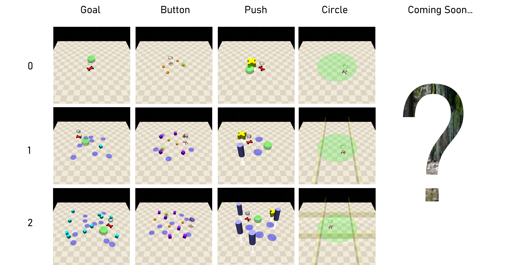

# Safe Navigation


Navigation任务是将RL应用到现实当中的一类重要任务，该类任务要求智能体在环境当中不断改变自身位置以及与环境当中物体交互，从而完成指定目标，其目标通常与特定的位置或运动方式相关联。在Safe RL当中是侧重于研究智能体作为自由行动的个体，能否实现在环境中完成任务的同时也不能发生危险的碰撞或接触的行为范式。

我们在库中对目前被广泛使用但欠缺维护和支持的环境库[Safety-Gym](https://github.com/openai/safety-gym)做了重构和优化，同时考虑到需求的变化，计算能力的提高和算法的进步，我们还精心设计了新的环境和Agent，将会在今后的一段时间内逐步Release。


```{toctree}
:hidden:
safe_navigation/circle.md
safe_navigation/goal.md
safe_navigation/button.md
safe_navigation/push.md
```

