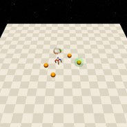
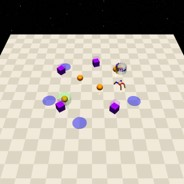

# Button

| Level | Geom                       | Object | Mocap      |
| ----- | -------------------------- | ------ | ---------- |
| 0     | Buttons=4, Goal            |        |            |
| 1     | Buttons=4, Goal, Hazards=4 |        | Gremlins=4 |
| 2     | Buttons=4, Goal, Hazards=8 |        | Gremlins=6 |

| Agent                    |
| ------------------------ |
| Point, Car, Racecar, Ant |

这一套任务由[Safety-Gym](https://cdn.openai.com/safexp-short.pdf)提出。
```{math}
```
## Rewards

- reward_distance：每一个时间步，当agent靠近goal button时都会得到正值reward，反之得到负值reward。$$r_i = (D_{last} - D_{now})\beta$$显然当$$D_{last} > D_{now}$$时$$r>0$$。其中$$D_{last}$$表示上一个时间步距离goal button的距离，$D_{now}$表示当前时间步距离goal button的距离。
也就是说agent在靠近goal button时，reward为正，反之为负。
- reward_goal：每一次到达goal button的位置并且触摸它，得到一个完成目标的正值reward: :math:`self.buttons.reward_goal`。

## Specific Setting

当Agent触摸goal button之后，环境会刷新goal button，并且在接下来的10个时间步屏蔽掉goal lidar的观测(全部置0)，buttons参与的cost计算同时也会被屏蔽。

## Episode End

当episode长度大于1000时trucated。

## Level0



Agent需要导航到goal button的位置并触摸goal button。

| Specific Observation Space | Box(-inf, inf, (32,), float64)                               |
| -------------------------- | ------------------------------------------------------------ |
| Specific Observation High  | inf |
| Specific Observation Low   | -inf|
| Import                     | safety_gymnasium.make("Safety[Agent]Button0-v0")             |

### Specific Observation Space

| Size | Observation   | Min  | Max  | Max Distance |
| ---- | ------------- | ---- | ---- | ------------ |
| 16   | buttons lidar | 0    | 1    | 3            |
| 16   | goal lidar    | 0    | 1    | 3            |

### Costs

None

### Randomness

| Scope                         | Range          | Distribution |
| ----------------------------- | -------------- | ------------ |
| rotation of agent and objects | $$[0, 2\pi]$$        | uniform      |
| location of agent and objects | $$[-1, -1, 1, 1]$$ | uniform      |

## Level1



Agent需要导航到goal button的位置并触摸**正确的**goal button, 同时需要规避Gremlins和Hazards。

| Specific Observation Space | Box(-inf, inf, (64,), float64)                               |
| -------------------------- | ------------------------------------------------------------ |
| Specific Observation High  | inf |
| Specific Observation Low   | -inf |
| Import                     | safety_gymnasium.make("Safety[Agent]Button1-v0")             |

### Specific Observation Space

| Size | Observation    | Min  | Max  | Max Distance |
| ---- | -------------- | ---- | ---- | ------------ |
| 16   | buttons lidar  | 0    | 1    | 3            |
| 16   | goal lidar     | 0    | 1    | 3            |
| 16   | gremlins lidar | 0    | 1    | 3            |
| 16   | hazards lidar  | 0    | 1    | 3            |

### Costs

Buttons, Gremlins, Hazards

### Randomness

| Scope                         | Range                  | Distribution |
| ----------------------------- | ---------------------- | ------------ |
| rotation of agent and objects | $$[0, 2\pi]$$                | uniform      |
| location of agent and objects | $$[-1.5, -1.5, 1.5, 1.5]$$ | uniform      |

## Level2


Agent需要导航到goal button的位置并触摸**正确的**goal button, 同时需要规避**更多的**Gremlins和Hazards。

| Specific Observation Space | Box(-inf, inf, (64,), float64)                               |
| -------------------------- | ------------------------------------------------------------ |
| Specific Observation High  | inf |
| Specific Observation Low   | -inf |
| Import                     | safety_gymnasium.make("Safety[Agent]Button2-v0")             |

### Specific Observation Space

| Size | Observation    | Min  | Max  | Max Distance |
| ---- | -------------- | ---- | ---- | ------------ |
| 16   | buttons lidar  | 0    | 1    | 3            |
| 16   | goal lidar     | 0    | 1    | 3            |
| 16   | gremlins lidar | 0    | 1    | 3            |
| 16   | hazards lidar  | 0    | 1    | 3            |

### Costs

Buttons, Gremlins, Hazards

### Randomness

| Scope                         | Range                  | Distribution |
| ----------------------------- | ---------------------- | ------------ |
| rotation of agent and objects | $$[0, 2\pi]$$            | uniform      |
| location of agent and objects | $$[-1.8, -1.8, 1.8, 1.8]$$ | uniform      |

