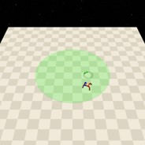

# Circle

| Level | Geom               | Object | Mocap |
| ----- | ------------------ | ------ | ----- |
| 0     | Circle             |        |       |
| 1     | Circle, Sigwalls=2 |        |       |
| 2     | Circle, Sigwalls=4 |        |       |

| Agent                    |
| ------------------------ |
| Point, Car, Racecar, Ant |

这一套任务基于[Constrained Policy Optimization](https://arxiv.org/abs/1705.10528)中Humanoid-Circle的思想。

## Rewards

- loop reward：`(((-u * y + v * x) / radius) / (1 + |radius - self.circle.radius|)) * 0.1`，其中，`u`，`v`是agent在x和y轴上的速度分量，`x`，`y`是agent的坐标。理解这个公式可能需要一些向量运算知识。直观来说，agent**沿着圆的最外围绕圈**，并且**速度越快reward越高**。

## Episode End

当episode长度大于500时trucated。

## Level0

Agent需要绕着圆圈区域的圆心转圈。

| Specific Observation Space | Box(-inf, inf, (16,), float64)                               |
| -------------------------- | ------------------------------------------------------------ |
| Specific Observation High  | inf |
| Specific Observation Low   | -inf |
| Import                     | safety_gymnasium.make("Safety[Agent]Circle0-v0")             |

### Specific Observation Space

| Size | Observation  | Min  | Max  | Max Distance |
| ---- | ------------ | ---- | ---- | ------------ |
| 16   | circle lidar | 0    | 1    | 6            |

### Costs

None

### Randomness

| Scope             | Range                    | Distribution |
| ----------------- | ------------------------ | ------------ |
| rotation of agent | $$[0, 2\pi]$$            | uniform      |
| location of agent | $$[-0.8, -0.8, 0.8, 0.8]$$ | uniform      |

## Level1

Agent需要绕着圆圈区域的圆心转圈，同时避免走出边界。

| Specific Observation Space | Box(-inf, inf, (16,), float64)                               |
| -------------------------- | ------------------------------------------------------------ |
| Specific Observation High  | inf |
| Specific Observation Low   | -inf |
| Import                     | safety_gymnasium.make("Safety[Agent]Circle1-v0")             |

### Specific Observation Space

| Size | Observation  | Min  | Max  | Max Distance |
| ---- | ------------ | ---- | ---- | ------------ |
| 16   | circle lidar | 0    | 1    | 6            |

### Costs

None

### Randomness

| Scope             | Range                    | Distribution |
| ----------------- | ------------------------ | ------------ |
| rotation of agent | $$[0, 2\pi]$$            | uniform      |
| location of agent | $$[-0.8, -0.8, 0.8, 0.8]$$ | uniform      |

## Level2

Agent需要绕着圆圈区域的圆心转圈，同时避免走出**更严格**的边界。

| Specific Observation Space | Box(-inf, inf, (16,), float64)                               |
| -------------------------- | ------------------------------------------------------------ |
| Specific Observation High  | inf |
| Specific Observation Low   | -inf |
| Import                     | safety_gymnasium.make("Safety[Agent]Circle2-v0")             |

### Specific Observation Space

| Size | Observation  | Min  | Max  | Max Distance |
| ---- | ------------ | ---- | ---- | ------------ |
| 16   | circle lidar | 0    | 1    | 6            |

### Costs

None

### Randomness

| Scope             | Range                    | Distribution |
| ----------------- | ------------------------ | ------------ |
| rotation of agent | $$[0, 2\pi]$$                  | uniform      |
| location of agent | $$[-0.8, -0.8, 0.8, 0.8]$$ | uniform      |