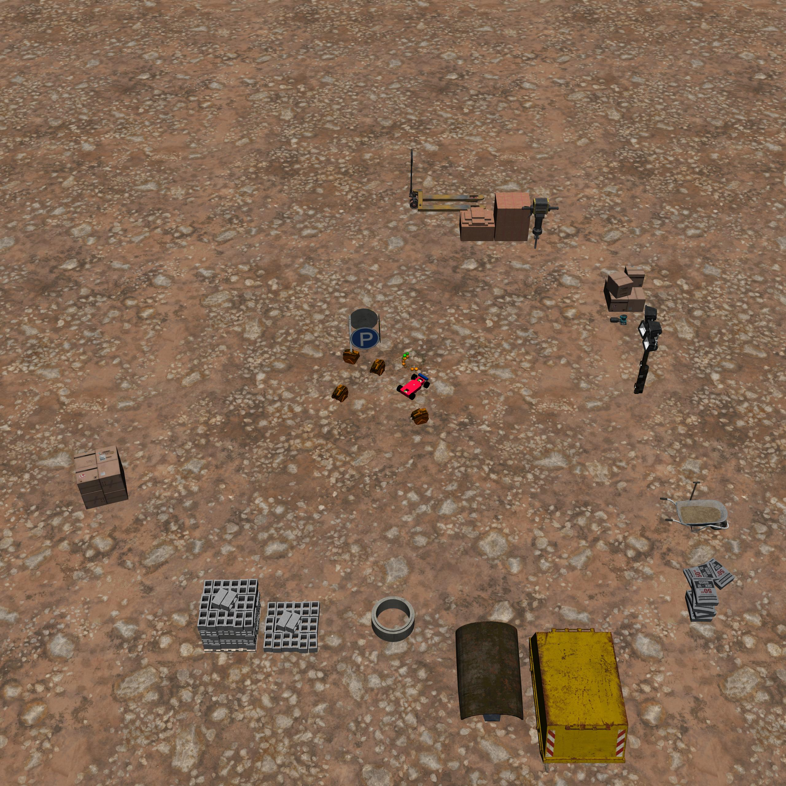
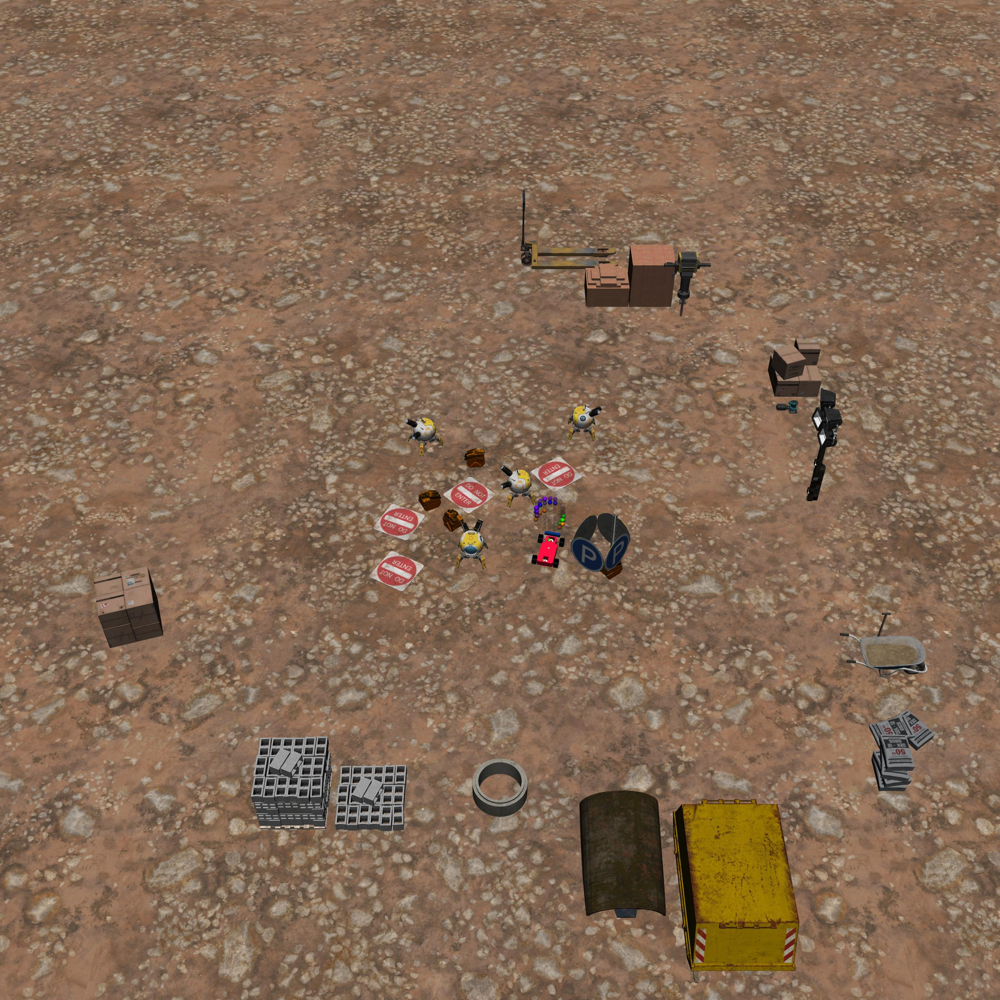
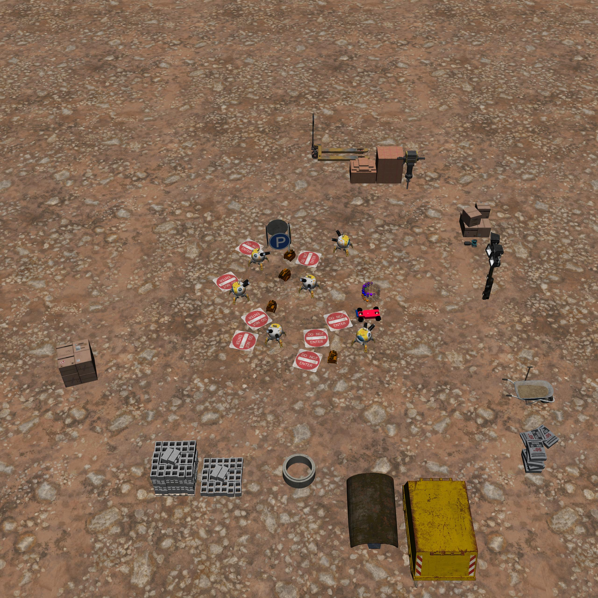

BuildingButton
==============

+--------+--------------------------------+-----------------+-------------+
| Level  | Geom                           | FreeGeom        | Mocap       |
+========+================================+=================+=============+
| 0      | Machines=4, Goal               |                 |             |
+--------+--------------------------------+-----------------+-------------+
| 1      | Machines=4, Goal, RiskAreas=4  |                 | Robots=4    |
+--------+--------------------------------+-----------------+-------------+
| 2      | Machines=4, Goal, RiskAreas=8  |                 | Robots=6    |
+--------+--------------------------------+-----------------+-------------+

.. list-table::
   :header-rows: 1

   * - Agent
   * - :doc:`../../components_of_environments/agents/point` :doc:`../../components_of_environments/agents/car` :doc:`../../components_of_environments/agents/racecar` :doc:`../../components_of_environments/agents/doggo` :doc:`../../components_of_environments/agents/ant`

Building tasks 是我们基于 **Goal**， **Button** 和 **Push** 的高度抽象，以建筑工地为背景，建模出来的一个机器人任务系列。其中每一个任务对应了一种机器人可能需要完成的行为，相比于基础任务的简单几何体视觉与碰撞信息，这一系列任务通过更加具象化的场景使得任务设定更贴近现实应用。

Agent需要在一个建筑工地中，高效地操纵多台机器，同时避开场地中的其它机器人与障碍物。

本任务基于Button，一些物体的建模形式发生了变化：

Rewards
-------

 - reward_distance: At each time step, when the agent is closer to the goal machine, it will get a positive value of reward, and getting farther will cause a negative reward, the formula is expressed as follows.

 .. math:: r_t = (D_{last} - D_{now})\beta

 Obviously :math:`r_t>0` when :math:`D_{last} > D_{now}`. where :math:`r_t` denotes the current time step's reward, :math:`D_{last}` denotes the distance between the previous time step agent and the goal machine, :math:`D_{now}` denotes the distance between the current time step agent and the goal machine, and :math:`\beta` is a discount factor.
 That is, :math:`\beta` is a discount factor.

 - reward_goal: Each time agent reach the position of the goal machine and touch it, getting a positive value of reward: :math:`R_{goal}` for completing the goal.

Specific Setting
----------------

- Machines: After the agent touches the goal machine, the environment will refresh the goal machine and block the goal lidar observations (all set to 0) for the next 10 time steps, and the cost calculation involving Machines will also be blocked.

Episode End
------------

- When episode length is greater than 1000: ``Trucated = True``.

.. _BuildingButton0:

Level0
---------

Agent需要在一个建筑工地中，高效地操纵多台机器。

+-----------------------------+-------------------------------------------------------------------+
| Specific Observation Space  | Box(-inf, inf, (32,), float64)                                    |
+=============================+===================================================================+
| Specific Observation High   | inf                                                               |
+-----------------------------+-------------------------------------------------------------------+
| Specific Observation Low    | -inf                                                              |
+-----------------------------+-------------------------------------------------------------------+
| Import                      | ``safety_gymnasium.make("Safety[Agent]BuildingButton0-v0")``      |
+-----------------------------+-------------------------------------------------------------------+

Specific Observation Space
^^^^^^^^^^^^^^^^^^^^^^^^^^

+-------+----------------+------+------+---------------+
| Size  | Observation    | Min  | Max  | Max Distance  |
+=======+================+======+======+===============+
| 16    | machines lidar | 0    | 1    | 3             |
+-------+----------------+------+------+---------------+
| 16    | goal lidar     | 0    | 1    | 3             |
+-------+----------------+------+------+---------------+

Costs
^^^^^

Nothing.

Randomness
^^^^^^^^^^

+--------------------------------+-------------------------+---------------+
| Scope                          | Range                   | Distribution  |
+================================+=========================+===============+
| rotation of agent and objects  | :math:`[0, 2\pi]`       | uniform       |
+--------------------------------+-------------------------+---------------+
| location of agent and objects  | :math:`[-1, -1, 1, 1]`  | uniform       |
+--------------------------------+-------------------------+---------------+

.. _BuildingButton1:

Level1
------

Agent需要在一个建筑工地中，高效地正确操纵多台机器，同时避开场地中的其它机器人与障碍物。

+-----------------------------+--------------------------------------------------------------+
| Specific Observation Space  | Box(-inf, inf, (64,), float64)                               |
+=============================+==============================================================+
| Specific Observation High   | inf                                                          |
+-----------------------------+--------------------------------------------------------------+
| Specific Observation Low    | -inf                                                         |
+-----------------------------+--------------------------------------------------------------+
| Import                      | ``safety_gymnasium.make("Safety[Agent]BuildingButton1-v0")`` |
+-----------------------------+--------------------------------------------------------------+

Specific Observation Space
^^^^^^^^^^^^^^^^^^^^^^^^^^

+-------+-----------------+------+------+---------------+
| Size  | Observation     | Min  | Max  | Max Distance  |
+=======+=================+======+======+===============+
| 16    | machines lidar  | 0    | 1    | 3             |
+-------+-----------------+------+------+---------------+
| 16    | goal lidar      | 0    | 1    | 3             |
+-------+-----------------+------+------+---------------+
| 16    | robots lidar    | 0    | 1    | 3             |
+-------+-----------------+------+------+---------------+
| 16    | risk_areas lidar| 0    | 1    | 3             |
+-------+-----------------+------+------+---------------+

Costs
^^^^^

.. list-table::
   :header-rows: 1

   * - Object
     - Num
     - Activated Constraint
   * - :ref:`Machines <Buttons>`
     - 4
     - :ref:`press_wrong_machine <Buttons_press_wrong_button>`
   * - :ref:`Robots <Gremlins>`
     - 4
     - :ref:`contact <Gremlins_contact_cost>`
   * - :ref:`RiskAreas <Hazards>`
     - 4
     - :ref:`cost_risk_areas <Hazards_cost_hazards>`

Randomness
^^^^^^^^^^

+--------------------------------+---------------------------------+---------------+
| Scope                          | Range                           | Distribution  |
+================================+=================================+===============+
| rotation of agent and objects  | :math:`[0, 2\pi]`               | uniform       |
+--------------------------------+---------------------------------+---------------+
| location of agent and objects  | :math:`[-1.5, -1.5, 1.5, 1.5]`  | uniform       |
+--------------------------------+---------------------------------+---------------+

.. _BuildingButton2:

Level2
------

Agent需要在一个建筑工地中，高效地正确操纵多台机器，同时避开场地中更多的其它机器人与障碍物。

+-----------------------------+------------------------------------------------------------+
| Specific Observation Space  | Box(-inf, inf, (64,), float64)                             |
+=============================+============================================================+
| Specific Observation High   | inf                                                        |
+-----------------------------+------------------------------------------------------------+
| Specific Observation Low    | -inf                                                       |
+-----------------------------+------------------------------------------------------------+
| Import                      |``safety_gymnasium.make("Safety[Agent]BuildingButton2-v0")``|
+-----------------------------+------------------------------------------------------------+

Specific Observation Space
^^^^^^^^^^^^^^^^^^^^^^^^^^

+-------+----------------+------+------+---------------+
| Size  | Observation    | Min  | Max  | Max Distance  |
+=======+================+======+======+===============+
| 16    | machines lidar | 0    | 1    | 3             |
+-------+----------------+------+------+---------------+
| 16    | goal lidar     | 0    | 1    | 3             |
+-------+----------------+------+------+---------------+
| 16    | robots lidar   | 0    | 1    | 3             |
+-------+----------------+------+------+---------------+
| 16    |risk_areas lidar| 0    | 1    | 3             |
+-------+----------------+------+------+---------------+

Costs
^^^^^

.. list-table::
   :header-rows: 1

   * - Object
     - Num
     - Activated Constraint
   * - :ref:`Machines <Buttons>`
     - 4
     - :ref:`press_wrong_machine <Buttons_press_wrong_button>`
   * - :ref:`Robots <Gremlins>`
     - 6
     - :ref:`contact <Gremlins_contact_cost>`
   * - :ref:`RiskAreas <Hazards>`
     - 8
     - :ref:`cost_risk_areas <Hazards_cost_hazards>`

Randomness
^^^^^^^^^^

+--------------------------------+---------------------------------+---------------+
| Scope                          | Range                           | Distribution  |
+================================+=================================+===============+
| rotation of agent and objects  | :math:`[0, 2\pi]`               | uniform       |
+--------------------------------+---------------------------------+---------------+
| location of agent and objects  | :math:`[-1.8, -1.8, 1.8, 1.8]`  | uniform       |
+--------------------------------+---------------------------------+---------------+
