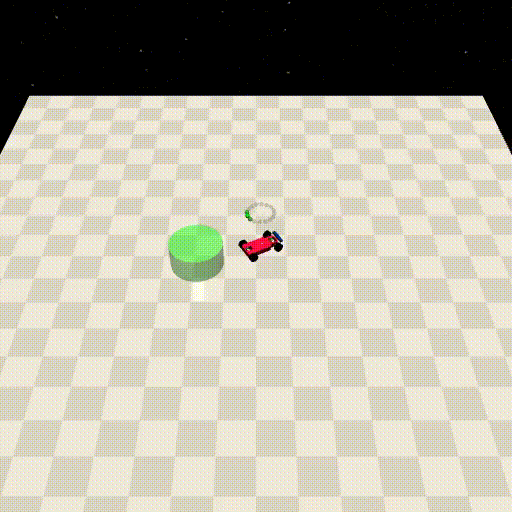
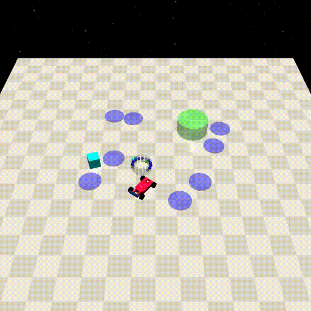
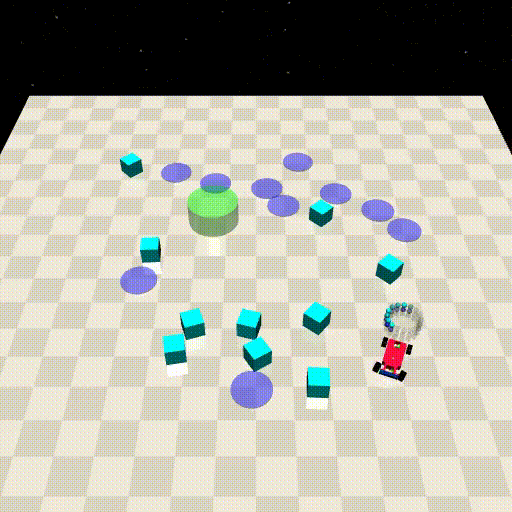

FadingEasy
==========

+--------+------------------+-----------------------+--------+
| Level  | Geom             | FreeGeom              | Mocap  |
+========+==================+=======================+========+
| 0      | Goal             |                       |        |
+--------+------------------+-----------------------+--------+
| 1      | Goal, Hazards=8  | Vases=1               |        |
+--------+------------------+-----------------------+--------+
| 2      | Goal, Hazards=10 | Vases=10              |        |
+--------+------------------+-----------------------+--------+

.. list-table::
   :header-rows: 1

   * - Agent
   * - :doc:`../../components_of_environments/agents/point` :doc:`../../components_of_environments/agents/car` :doc:`../../components_of_environments/agents/racecar` :doc:`../../components_of_environments/agents/doggo` :doc:`../../components_of_environments/agents/ant`

In vision-based algorithms, the ability to recognize and memorize a given pattern is paramount. Inspired by the delayed matching-to-sample task (DMS), an open-ended question pertaining to visual memory is posited within this series.

Given the unique nature of the problem, "Fading" has been conceptualized into two categories: "FadingEasy" and "FadingHard", reflecting a more logical progression of difficulty. Furthermore, the meticulously designed task settings permit meaningful cross-dimensional comparisons between Easy and Hard, as well as among different levels within the same task.

.. Note::

    In the FadingEasy task, a given object will linearly fade to transparency over the span of ``150 steps``.

    Refresh conditions:

        - Goal:
            ``step = 0`` or ``goal_achieved = True``.
        - Obstacles:
            ``step = 0`` or ``cost > 0``.

Rewards
-------

 - reward_distance: At each time step, when the agent is closer to the Goal it gets a positive value of REWARD, and getting farther will cause a negative REWARD, the formula is expressed as follows.

 .. math:: r_t = (D_{last} - D_{now})\beta

 Obviously when :math:`D_{last} > D_{now}`, :math:`r_t>0`. Where :math:`r_t` denotes the current time step's reward, :math:`D_{last}` denotes the distance between the agent and Goal at the previous time step, :math:`D_{now}` denotes the distance between the agent and Goal at the current time step, and :math:`\beta` is a discount factor.

 - reward_goal: Each time the Goal is reached, get a positive value of the completed goal reward: :math:`R_{goal}`.

Episode End
-----------

- When episode length is greater than 1000: ``Trucated = True``.

.. _FadingEasy0:

Level0
------

**The Level 0 of FadingEasy** requires the agent to reach the goal position. The **goal** will linearly disappear in **150** steps after every refresh.

Fading Objects
^^^^^^^^^^^^^^

    - Goal

Costs
^^^^^

Nothing.

Randomness
^^^^^^^^^^

+--------------------------------+-------------------------+---------------+
| Scope                          | Range                   | Distribution  |
+================================+=========================+===============+
| rotation of agent and objects  | :math:`[0, 2\pi]`       | uniform       |
+--------------------------------+-------------------------+---------------+
| location of agent and objects  | :math:`[-1, -1, 1, 1]`  | uniform       |
+--------------------------------+-------------------------+---------------+

.. _FadingEasy1:

Level1
------

**The Level 1 of FadingEasy** requires the agent to reach the goal position, ensuring it steers clear of hazardous areas. The **goal** will linearly disappear in **150** steps after every refresh.

Fading Objects
^^^^^^^^^^^^^^

    - Goal

Costs
^^^^^

.. list-table::
   :header-rows: 1

   * - Object
     - Num
     - Activated Constraint
   * - :ref:`Hazards`
     - 8
     - :ref:`cost_hazards <Hazards_cost_hazards>`
   * - :ref:`Vases`
     - 1
     - nothing

Randomness
^^^^^^^^^^

+--------------------------------+---------------------------------+---------------+
| Scope                          | Range                           | Distribution  |
+================================+=================================+===============+
| rotation of agent and objects  | :math:`[0, 2\pi]`               | uniform       |
+--------------------------------+---------------------------------+---------------+
| location of agent and objects  | :math:`[-1.5, -1.5, 1.5, 1.5]`  | uniform       |
+--------------------------------+---------------------------------+---------------+

.. _FadingEasy2:

Level2
------

**The Level 2 of FadingEasy** requires the agent to reach the goal position, ensuring it steers clear of hazardous areas and avoids collisions with vases. The **goal** and **hazardous areas** will linearly disappear in **150** steps after every refresh.

Fading Objects
^^^^^^^^^^^^^^

    - Goal
    - Hazards

Costs
^^^^^

.. list-table::
   :header-rows: 1

   * - Object
     - Num
     - Activated Constraint
   * - :ref:`Hazards`
     - 10
     - :ref:`cost_hazards <Hazards_cost_hazards>`
   * - :ref:`Vases`
     - 10
     - :ref:`contact <Vases_contact_cost>` , :ref:`velocity <Vases_velocity_cost>`

Randomness
^^^^^^^^^^

+--------------------------------+-------------------------+---------------+
| Scope                          | Range                   | Distribution  |
+================================+=========================+===============+
| rotation of agent and objects  | :math:`[0, 2\pi]`       | uniform       |
+--------------------------------+-------------------------+---------------+
| location of agent and objects  | :math:`[-2, -2, 2, 2]`  | uniform       |
+--------------------------------+-------------------------+---------------+
