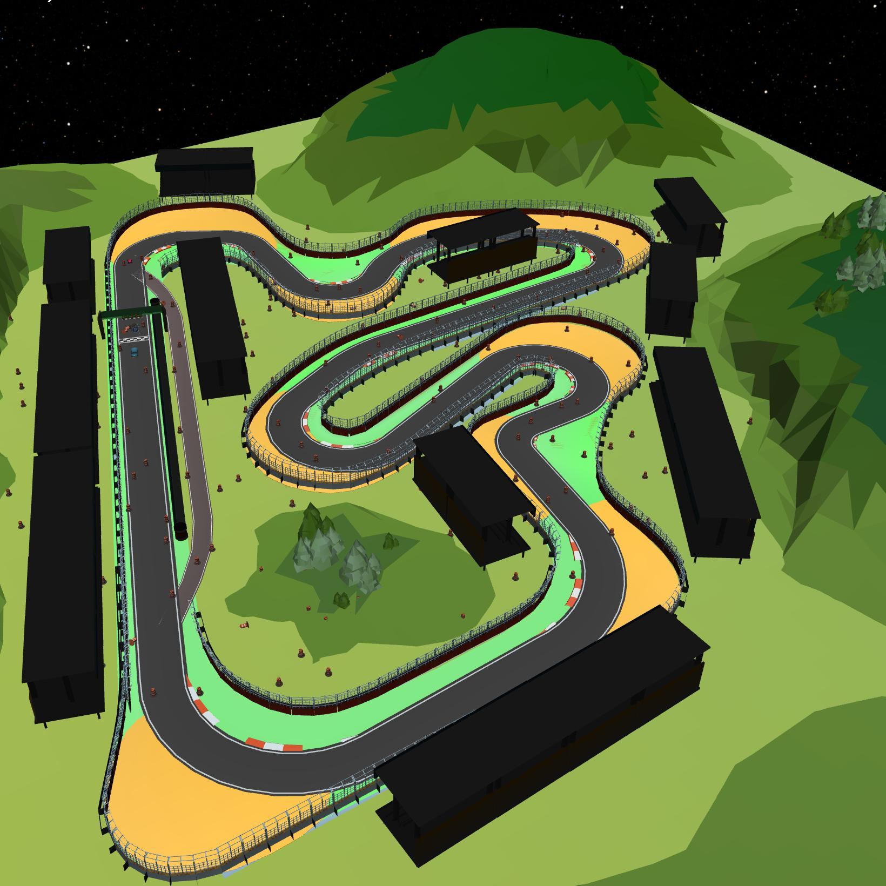

FormulaOne
==========

+--------+------------------------+-----------------------+--------+
| Level  | Geom                   | FreeGeom              | Mocap  |
+========+========================+=======================+========+
| 0      | StagedGoal             |                       |        |
+--------+------------------------+-----------------------+--------+
| 1      | StagedGoal             | RoadBarriers=200      |        |
+--------+------------------------+-----------------------+--------+
| 2      | StagedGoal             | RoadBarriers=200      |        |
+--------+------------------------+-----------------------+--------+

.. list-table::
   :header-rows: 1

   * - Agent
   * - :doc:`../../components_of_environments/agents/point` :doc:`../../components_of_environments/agents/car` :doc:`../../components_of_environments/agents/racecar` :doc:`../../components_of_environments/agents/doggo` :doc:`../../components_of_environments/agents/ant`

This series of tasks, set against the backdrop of Formula 1 racing events, offers abundant visual data and expansive maps, presenting a heightened challenge to the capabilities of algorithms.

Rewards
-------

 - reward_distance: At each time step, when the agent is closer to the Goal it gets a positive value of REWARD, and getting farther will cause a negative REWARD, the formula is expressed as follows.

 .. math:: r_t = (D_{last} - D_{now})\beta

 Obviously when :math:`D_{last} > D_{now}`, :math:`r_t>0`. Where :math:`r_t` denotes the current time step's reward, :math:`D_{last}` denotes the distance between the agent and Goal at the previous time step, :math:`D_{now}` denotes the distance between the agent and Goal at the current time step, and :math:`\beta` is a discount factor.

 - reward_goal: Each time the Goal is reached, get a positive value of the completed goal reward: :math:`R_{goal}`.

Episode End
-----------

- When episode length is greater than 1000: ``Trucated = True``.

.. _FormulaOne0:

Level0
------

**The Level 0 of FormulaOne** requires the agent to maximize its reach to the goal position. For each episode, the agent is randomly initialized at one of the seven checkpoints.

+-----------------------------+------------------------------------------------------------------+
| Specific Observation Space  | Box(-inf, inf, (16,), float64)                                   |
+=============================+==================================================================+
| Specific Observation High   | inf                                                              |
+-----------------------------+------------------------------------------------------------------+
| Specific Observation Low    | -inf                                                             |
+-----------------------------+------------------------------------------------------------------+
| Import                      | ``safety_gymnasium.make("Safety[Agent]FormulaOne0-v0")``         |
+-----------------------------+------------------------------------------------------------------+

Specific Observation Space
^^^^^^^^^^^^^^^^^^^^^^^^^^

+-------+--------------+------+------+---------------+
| Size  | Observation  | Min  | Max  | Max Distance  |
+=======+==============+======+======+===============+
| 16    | goal lidar   | 0    | 1    | 3             |
+-------+--------------+------+------+---------------+

Costs
^^^^^

.. list-table::
   :header-rows: 1

   * - Object
     - Num
     - Activated Constraint
   * - :ref:`Fixedwalls`
     -
     - :ref:`cost_static_geoms_contact <Static_geoms_contact_cost>`

Randomness
^^^^^^^^^^

+--------------------------------+------------------------------------------------------------------------------------------------+---------------+
| Scope                          | Range/Locations                                                                                | Distribution  |
+================================+================================================================================================+===============+
| rotation of agent and objects  | [0, 2π]                                                                                        | uniform       |
+--------------------------------+------------------------------------------------------------------------------------------------+---------------+
| location of agent              | [(3, 9), (13, -1.7), (26, 0.05), (32, -7), (4, -17.5), (19.0, -20.7), (-0.85, -0.4)]           | uniform       |
+--------------------------------+------------------------------------------------------------------------------------------------+---------------+
| location of StagedGoal         | at the next point of agent's location                                                          |               |
+--------------------------------+------------------------------------------------------------------------------------------------+---------------+

.. _FormulaOne1:

Level1
------

**The Level 1 of FormulaOne** requires the agent to maximize its reach to the goal position while circumventing barriers and racetrack fences. For each episode, the agent is randomly initialized at one of the seven checkpoints.

+-----------------------------+----------------------------------------------------------------+
| Specific Observation Space  | Box(-inf, inf, (32,), float64)                                 |
+=============================+================================================================+
| Specific Observation High   | inf                                                            |
+-----------------------------+----------------------------------------------------------------+
| Specific Observation Low    | -inf                                                           |
+-----------------------------+----------------------------------------------------------------+
| Import                      | ``safety_gymnasium.make("Safety[Agent]FormulaOne1-v0")``       |
+-----------------------------+----------------------------------------------------------------+

Specific Observation Space
^^^^^^^^^^^^^^^^^^^^^^^^^^

+-------+------------------------+------+------+---------------+
| Size  | Observation            | Min  | Max  | Max Distance  |
+=======+========================+======+======+===============+
| 16    | goal lidar             | 0    | 1    | 3             |
+-------+------------------------+------+------+---------------+
| 16    | road_barriers lidar    | 0    | 1    | 3             |
+-------+------------------------+------+------+---------------+

Costs
^^^^^

.. list-table::
   :header-rows: 1

   * - Object
     - Num
     - Activated Constraint
   * - :ref:`Fixedwalls`
     -
     - :ref:`cost_static_geoms_contact <Static_geoms_contact_cost>`
   * - :ref:`RoadBarriers <Vases>`
     - 200
     - :ref:`contact <Vases_contact_cost>`

Randomness
^^^^^^^^^^

+------------------------------------------------------+--------------------------------------------------------------------------------------------------------------------------------------------------------------------------------------------------------------+---------------------------------------------------------------------------+
| Scope                                                | Range/Locations                                                                                                                                                                                              | Distribution                                                              |
+======================================================+==============================================================================================================================================================================================================+===========================================================================+
| rotation of agent and objects                        | [0, 2π]                                                                                                                                                                                                      | uniform                                                                   |
+------------------------------------------------------+--------------------------------------------------------------------------------------------------------------------------------------------------------------------------------------------------------------+---------------------------------------------------------------------------+
| location of agent                                    | [(3, 9), (13, -1.7), (26, 0.05), (32, -7), (4, -17.5), (19.0, -20.7), (-0.85, -0.4)]                                                                                                                         | uniform                                                                   |
+------------------------------------------------------+--------------------------------------------------------------------------------------------------------------------------------------------------------------------------------------------------------------+---------------------------------------------------------------------------+
| location of StagedGoal                               | at the next point of agent's location                                                                                                                                                                        |                                                                           |
+------------------------------------------------------+--------------------------------------------------------------------------------------------------------------------------------------------------------------------------------------------------------------+---------------------------------------------------------------------------+
| locations of RoadBarriers                            | [(-12.2, -32.5, 27.8, 7.5), (26, -11, 38, 1)]                                                                                                                                                                | uniform                                                                   |
+------------------------------------------------------+--------------------------------------------------------------------------------------------------------------------------------------------------------------------------------------------------------------+---------------------------------------------------------------------------+

.. _FormulaOne2:

Level2
------

**The Level 2 of FormulaOne** requires the agent to maximize its reach to the goal position while circumventing barriers and racetrack fences. For each episode, the agent is randomly initialized at one of the seven checkpoints. Notably, the barriers surrounding the checkpoints are denser.

+-----------------------------+-----------------------------------------------------------+
| Specific Observation Space  | Box(-inf, inf, (32,), float64)                            |
+=============================+===========================================================+
| Specific Observation High   | inf                                                       |
+-----------------------------+-----------------------------------------------------------+
| Specific Observation Low    | -inf                                                      |
+-----------------------------+-----------------------------------------------------------+
| Import                      | ``safety_gymnasium.make("Safety[Agent]FormulaOne2-v0")``  |
+-----------------------------+-----------------------------------------------------------+

Specific Observation Space
^^^^^^^^^^^^^^^^^^^^^^^^^^

+-------+------------------------+------+------+---------------+
| Size  | Observation            | Min  | Max  | Max Distance  |
+=======+========================+======+======+===============+
| 16    | goal lidar             | 0    | 1    | 3             |
+-------+------------------------+------+------+---------------+
| 16    | road_barriers lidar    | 0    | 1    | 3             |
+-------+------------------------+------+------+---------------+

Costs
^^^^^

.. list-table::
   :header-rows: 1

   * - Object
     - Num
     - Activated Constraint
   * - :ref:`Fixedwalls`
     -
     - :ref:`cost_static_geoms_contact <Static_geoms_contact_cost>`
   * - :ref:`RoadBarriers <Vases>`
     - 200
     - :ref:`contact <Vases_contact_cost>`

Randomness
^^^^^^^^^^

+------------------------------------------------------+--------------------------------------------------------------------------------------------------------------------------------------------------------------------------------------------------------------+---------------------------------------------------------------------------+
| Scope                                                | Range/Locations                                                                                                                                                                                              | Distribution                                                              |
+======================================================+==============================================================================================================================================================================================================+===========================================================================+
| rotation of agent and objects                        | [0, 2π]                                                                                                                                                                                                      | uniform                                                                   |
+------------------------------------------------------+--------------------------------------------------------------------------------------------------------------------------------------------------------------------------------------------------------------+---------------------------------------------------------------------------+
| location of agent                                    | [(3, 9), (13, -1.7), (26, 0.05), (32, -7), (4, -17.5), (19.0, -20.7), (-0.85, -0.4)]                                                                                                                         | uniform                                                                   |
+------------------------------------------------------+--------------------------------------------------------------------------------------------------------------------------------------------------------------------------------------------------------------+---------------------------------------------------------------------------+
| location of StagedGoal                               | at the next point of agent's location                                                                                                                                                                        |                                                                           |
+------------------------------------------------------+--------------------------------------------------------------------------------------------------------------------------------------------------------------------------------------------------------------+---------------------------------------------------------------------------+
| locations of RoadBarriers                            | [(-12.2, -32.5, 27.8, 7.5), (26, -11, 38, 1)]                                                                                                                                                                | uniform                                                                   |
+------------------------------------------------------+--------------------------------------------------------------------------------------------------------------------------------------------------------------------------------------------------------------+---------------------------------------------------------------------------+
| locations of RoadBarriers near checkpoints           |  [(-1, -1, 1, 1), (1.5, 7.5, 4.5, 10.5), (11.5, -3.2, 14.5, -0.19), (24.5, -1.45, 27.5, 1.55), (30.5, -8.5, 33.5, -5.5), (2.5, -19.0, 5.5, -16.0), (17.5, -22.2, 20.5, -19.2), (-2.35, -1.9, 0.65, 1.1)]     | uniform, 10x more likely than non-checkpoint areas                        |
+------------------------------------------------------+--------------------------------------------------------------------------------------------------------------------------------------------------------------------------------------------------------------+---------------------------------------------------------------------------+
