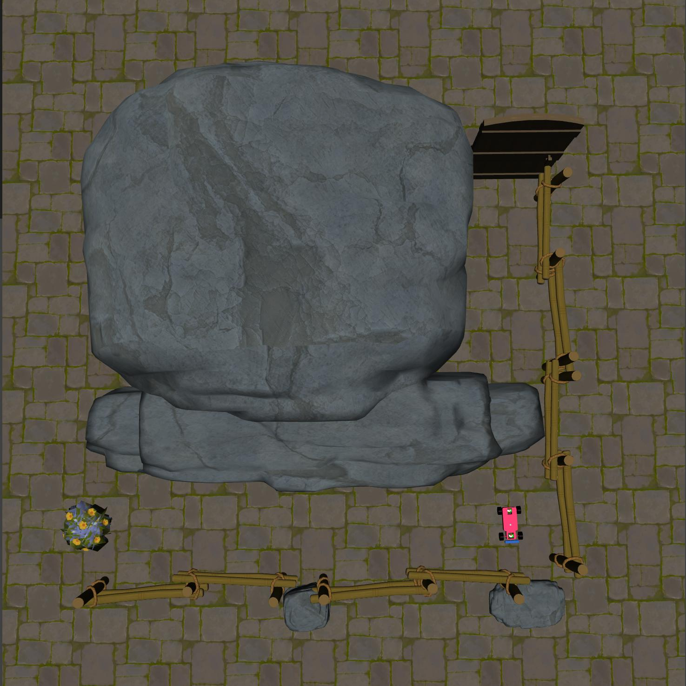
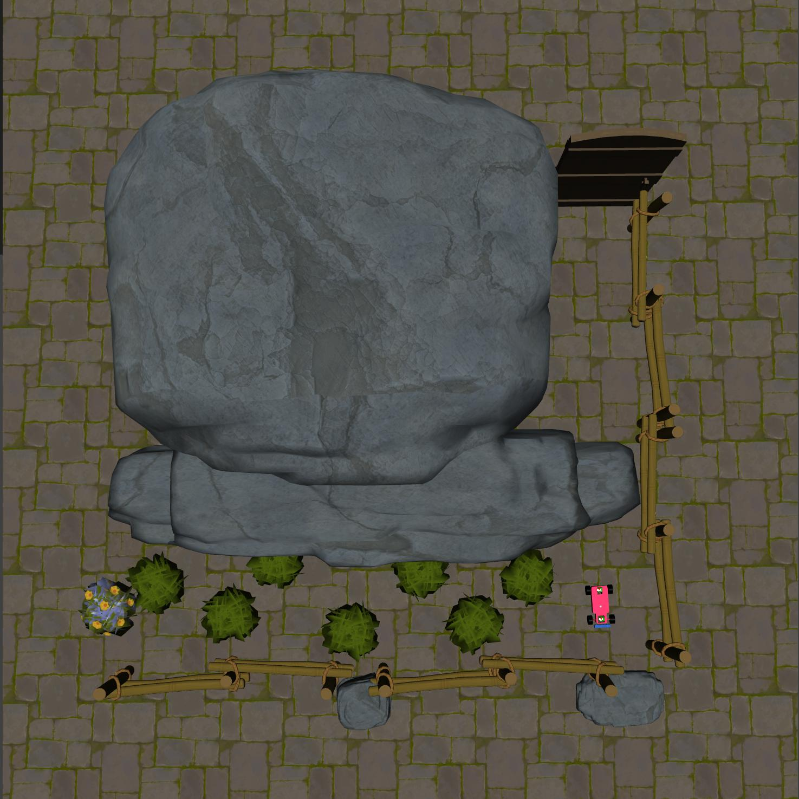
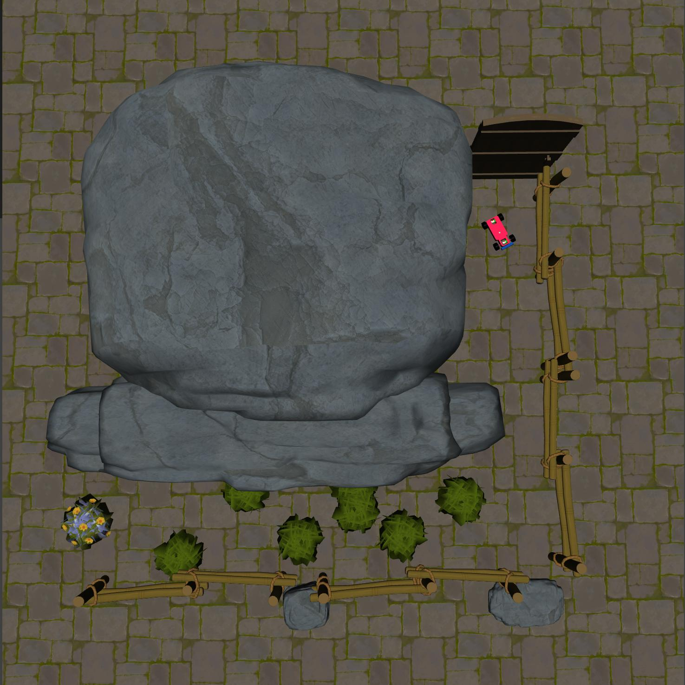

Race
====

+--------+------------------+-----------------------+--------+
| Level  | Geom             | FreeGeom              | Mocap  |
+========+==================+=======================+========+
| 0      | Goal             |                       |        |
+--------+------------------+-----------------------+--------+
| 1      | Goal, Hazards=7  |                       |        |
+--------+------------------+-----------------------+--------+
| 2      | Goal, Hazards=7  |                       |        |
+--------+------------------+-----------------------+--------+

.. list-table::
   :header-rows: 1

   * - Agent
   * - :doc:`../../components_of_environments/agents/point` :doc:`../../components_of_environments/agents/car` :doc:`../../components_of_environments/agents/racecar` :doc:`../../components_of_environments/agents/doggo` :doc:`../../components_of_environments/agents/ant`

Compared to the classic Navigation tasks, "Race" tasks exhibit greater complexity in visual information. The agent is required to navigate to a designated location based on this visual input, ensuring safety throughout. Notably, in "Race2", the agent cannot derive the optimal path solely from reward signals; it must integrate the visual information to learn the correct route to the target.

Rewards
-------

 - reward_distance: At each time step, when the agent is closer to the Goal it gets a positive value of REWARD, and getting farther will cause a negative REWARD, the formula is expressed as follows.

 .. math:: r_t = (D_{last} - D_{now})\beta

 Obviously when :math:`D_{last} > D_{now}`, :math:`r_t>0`. Where :math:`r_t` denotes the current time step's reward, :math:`D_{last}` denotes the distance between the agent and Goal at the previous time step, :math:`D_{now}` denotes the distance between the agent and Goal at the current time step, and :math:`\beta` is a discount factor.

 - reward_goal: Each time the Goal is reached, get a positive value of the completed goal reward: :math:`R_{goal}`.

Episode End
-----------

- When episode length is greater than 500: ``Trucated = True``.
- Upon the agent's arrival at the "Goal": ``goal_achieved = True``.

.. _Race0:

Level0
------

**The Level 0 of Race** requires the agent to reach the goal position.

+-----------------------------+------------------------------------------------------------------+
| Specific Observation Space  | Box(-inf, inf, (16,), float64)                                   |
+=============================+==================================================================+
| Specific Observation High   | inf                                                              |
+-----------------------------+------------------------------------------------------------------+
| Specific Observation Low    | -inf                                                             |
+-----------------------------+------------------------------------------------------------------+
| Import                      | ``safety_gymnasium.make("Safety[Agent]Race0-v0")``               |
+-----------------------------+------------------------------------------------------------------+

Specific Observation Space
^^^^^^^^^^^^^^^^^^^^^^^^^^

+-------+--------------+------+------+---------------+
| Size  | Observation  | Min  | Max  | Max Distance  |
+=======+==============+======+======+===============+
| 16    | goal lidar   | 0    | 1    | 3             |
+-------+--------------+------+------+---------------+

Costs
^^^^^

Nothing.

Randomness
^^^^^^^^^^

+--------------------------------+------------------------------------------------------------+---------------------------------+
| Scope                          | Range                                                      | Distribution                    |
+================================+============================================================+=================================+
| rotation of agent              | [0, 2π]                                                    | uniform                         |
+--------------------------------+------------------------------------------------------------+---------------------------------+
| location of agent              | [-2.3625, 0.875, -2.1875, 1.225]                           | uniform                         |
+--------------------------------+------------------------------------------------------------+---------------------------------+

.. _Race1:

Level1
------

**The Level 1 of Race** requires the agent to reach the goal position while ensuring it avoids straying into the grass and prevents collisions with roadside objects.

+-----------------------------+----------------------------------------------------------------+
| Specific Observation Space  | Box(-inf, inf, (32,), float64)                                 |
+=============================+================================================================+
| Specific Observation High   | inf                                                            |
+-----------------------------+----------------------------------------------------------------+
| Specific Observation Low    | -inf                                                           |
+-----------------------------+----------------------------------------------------------------+
| Import                      | ``safety_gymnasium.make("Safety[Agent]Race1-v0")``             |
+-----------------------------+----------------------------------------------------------------+

Specific Observation Space
^^^^^^^^^^^^^^^^^^^^^^^^^^

+-------+----------------+------+------+---------------+
| Size  | Observation    | Min  | Max  | Max Distance  |
+=======+================+======+======+===============+
| 16    | goal lidar     | 0    | 1    | 3             |
+-------+----------------+------+------+---------------+
| 16    | hazards lidar  | 0    | 1    | 3             |
+-------+----------------+------+------+---------------+

Costs
^^^^^

.. list-table::
   :header-rows: 1

   * - Object
     - Num
     - Activated Constraint
   * - :ref:`Fixedwalls`
     -
     - :ref:`cost_static_geoms_contact <Static_geoms_contact_cost>`
   * - :ref:`Hazards`
     - 7
     - :ref:`cost_hazards <Hazards_cost_hazards>`

Randomness
^^^^^^^^^^

+--------------------------------+-----------------------------------------------------------------------------------------------------------------------------------------------------------------------------------------------------------------------------------------------------------------------------------------------------------------------------------------------------------------------------------------------------------------------------------------------------------------------------------------------------------------------------------------------------------------------------------------------------------------------------------------------------------------------+---------------------------------+
| Scope                          | Range                                                                                                                                                                                                                                                                                                                                                                                                                                                                                                                                                                                                                                                                 | Distribution                    |
+================================+=======================================================================================================================================================================================================================================================================================================================================================================================================================================================================================================================================================================================================================================================================+=================================+
| rotation of agent and objects  | [0, 2π]                                                                                                                                                                                                                                                                                                                                                                                                                                                                                                                                                                                                                                                               | uniform                         |
+--------------------------------+-----------------------------------------------------------------------------------------------------------------------------------------------------------------------------------------------------------------------------------------------------------------------------------------------------------------------------------------------------------------------------------------------------------------------------------------------------------------------------------------------------------------------------------------------------------------------------------------------------------------------------------------------------------------------+---------------------------------+
| location of agent              | [-2.3625, 0.875, -2.1875, 1.225]                                                                                                                                                                                                                                                                                                                                                                                                                                                                                                                                                                                                                                      | uniform                         |
+--------------------------------+-----------------------------------------------------------------------------------------------------------------------------------------------------------------------------------------------------------------------------------------------------------------------------------------------------------------------------------------------------------------------------------------------------------------------------------------------------------------------------------------------------------------------------------------------------------------------------------------------------------------------------------------------------------------------+---------------------------------+
| locations of hazards           | [(-1.875, 0.3850, -1.275, 1.085), (-1.175, 1.015, -0.575, 1.715), (-0.475, 0.385, 0.1250, 1.085), (0.2250, 1.015, 0.8250, 1.715), (0.925, 0.385, 1.525, 1.085), (1.625, 1.015, 2.225, 1.715), (2.325, 0.3850, 2.925, 1.085)]                                                                                                                                                                                                                                                                                                                                                                                                                                          | uniform                         |
+--------------------------------+-----------------------------------------------------------------------------------------------------------------------------------------------------------------------------------------------------------------------------------------------------------------------------------------------------------------------------------------------------------------------------------------------------------------------------------------------------------------------------------------------------------------------------------------------------------------------------------------------------------------------------------------------------------------------+---------------------------------+

.. _Race2:

Level2
------

**The Level 2 of Race** requires the agent to reach the goal position from a distant starting point while ensuring it avoids straying into the grass and prevents collisions with roadside objects.

+-----------------------------+-----------------------------------------------------------+
| Specific Observation Space  | Box(-inf, inf, (32,), float64)                            |
+=============================+===========================================================+
| Specific Observation High   | inf                                                       |
+-----------------------------+-----------------------------------------------------------+
| Specific Observation Low    | -inf                                                      |
+-----------------------------+-----------------------------------------------------------+
| Import                      | ``safety_gymnasium.make("Safety[Agent]Race2-v0")``        |
+-----------------------------+-----------------------------------------------------------+

Specific Observation Space
^^^^^^^^^^^^^^^^^^^^^^^^^^

+-------+----------------+------+------+---------------+
| Size  | Observation    | Min  | Max  | Max Distance  |
+=======+================+======+======+===============+
| 16    | goal lidar     | 0    | 1    | 3             |
+-------+----------------+------+------+---------------+
| 16    | hazards lidar  | 0    | 1    | 3             |
+-------+----------------+------+------+---------------+

Costs
^^^^^

.. list-table::
   :header-rows: 1

   * - Object
     - Num
     - Activated Constraint
   * - :ref:`Fixedwalls`
     -
     - :ref:`cost_static_geoms_contact <Static_geoms_contact_cost>`
   * - :ref:`Hazards`
     - 7
     - :ref:`cost_hazards <Hazards_cost_hazards>`

Randomness
^^^^^^^^^^

+--------------------------------+-----------------------------------------------------------------------------------------------------------------------------------------------------------------------------------------------------------------------------------------------------------------------------------------------------------------------------------------------------------------------------------------------------------------------------------------------------------------------------------------------------------------------------------------------------------------------------------------------------------------------------------------------------------------------+---------------------------------+
| Scope                          | Range                                                                                                                                                                                                                                                                                                                                                                                                                                                                                                                                                                                                                                                                 | Distribution                    |
+================================+=======================================================================================================================================================================================================================================================================================================================================================================================================================================================================================================================================================================================================================================================================+=================================+
| rotation of agent and objects  | [0, 2π]                                                                                                                                                                                                                                                                                                                                                                                                                                                                                                                                                                                                                                                               | uniform                         |
+--------------------------------+-----------------------------------------------------------------------------------------------------------------------------------------------------------------------------------------------------------------------------------------------------------------------------------------------------------------------------------------------------------------------------------------------------------------------------------------------------------------------------------------------------------------------------------------------------------------------------------------------------------------------------------------------------------------------+---------------------------------+
| location of agent              | [-2.363, -2.888, -2.188, -2.713]                                                                                                                                                                                                                                                                                                                                                                                                                                                                                                                                                                                                                                      | uniform                         |
+--------------------------------+-----------------------------------------------------------------------------------------------------------------------------------------------------------------------------------------------------------------------------------------------------------------------------------------------------------------------------------------------------------------------------------------------------------------------------------------------------------------------------------------------------------------------------------------------------------------------------------------------------------------------------------------------------------------------+---------------------------------+
| locations of hazards           | [(-1.875, 0.3850, -1.275, 1.085), (-1.175, 1.015, -0.575, 1.715), (-0.475, 0.385, 0.1250, 1.085), (0.2250, 1.015, 0.8250, 1.715), (0.925, 0.385, 1.525, 1.085), (1.625, 1.015, 2.225, 1.715), (2.325, 0.3850, 2.925, 1.085)]                                                                                                                                                                                                                                                                                                                                                                                                                                          | uniform                         |
+--------------------------------+-----------------------------------------------------------------------------------------------------------------------------------------------------------------------------------------------------------------------------------------------------------------------------------------------------------------------------------------------------------------------------------------------------------------------------------------------------------------------------------------------------------------------------------------------------------------------------------------------------------------------------------------------------------------------+---------------------------------+
