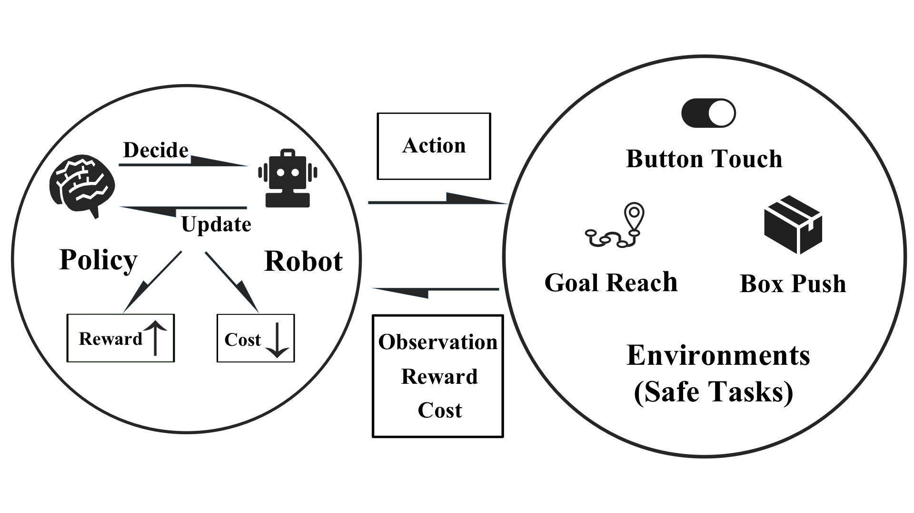

Overview
========

About Safe RL
-------------

In recent years, RL (reinforcement learning) algorithms, especially DeepRL algorithms, have achieved good performance in numerous tasks. For example: gaining high scores in Atari games using only visual input, fulfilling complex control tasks in high dimensions, and beating human grandmasters in Go competitions. However, in the process of policy optimization in RL, there are problems that need Safe RL to solve.

.. grid:: 12 4 4 4

    .. grid-item-card::
        :class-item: sd-font-weight-bold
        :class-header: sd-bg-danger sd-text-white sd-font-weight-bold
        :class-card: sd-outline-success sd-border-{3} sd-shadow-sm sd-rounded-3
        :columns: 12 6 6 6

        Problems
        ^^^^^^^^^^^^^
        Agents may learn

        - Reward Hacking
        - Risk Behavior
        - Unrealistic Strategy

        to improve their cumulative rewards, This may lead to **one-sided pursuit of reward** and **contradict the original purpose** of our reward design.

    .. grid-item-card::
        :class-item: sd-font-weight-bold
        :class-header: sd-bg-info sd-text-white sd-font-weight-bold
        :class-card: sd-outline-success sd-border-{3} sd-shadow-sm sd-rounded-3
        :columns: 12 6 6 6

        Solutions
        ^^^^^^^^^^^^^^^^^
        Therefore, the **Safe RL algorithm aims to** train the Agent to act while

        - Maximizing the reward
        - Satisfying the given constraints.

        so as to avoid learning behavioral policies that are out of touch with reality and one-sidedly pursue reward.

.. centered:: The overview of Safe Reinforcement Learning

Reinforcement learning can be considered as an agent continuously optimizing its own policy by learning from a given reward signal, and is very effective in solving problems that cannot be strictly modeled mathematically. On this foundation, Safe RL can also be broadly understood as a **constraint solving problem**: the agent needs to learn the reward signal along with the constraint signal to maximize the reward while satisfying the constraint.

Safety-Gymnasium
----------------

Safety-Gymnasium is a **highly modular**, **minimally readable** and **easily customizable** benchmark environment library based on **MuJoCo** to facilitate research in the Safe RL domain.

Feature
^^^^^^^

- Highly modular. Splitting the different components of an environment into logically self-contained modules: agents, tasks, objects.
- Streamlined and easy to read code. Maximize code streamlining while ensuring **readability** and **aesthetics**, with an average of **no more than 100 lines of code** per task.
- Easy to customize. The well-designed code framework is friendly to the requirement of customizing the environment.
- Rich and reliable environment. Two novel task families, **Manipualtion** and **Vision**, are provided.
- Good support and refactoring of the classic Safe RL environment: **Safety-Gym** , **Safety-Velocity**.
- Less dependence.
- Easy to install.
